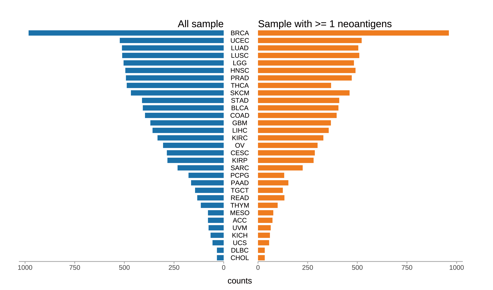
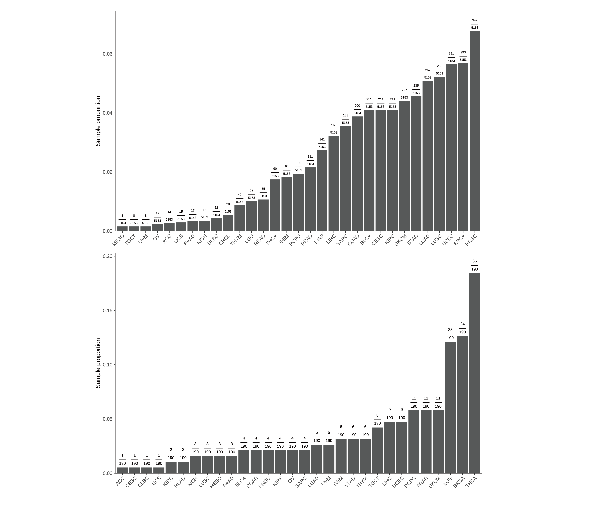
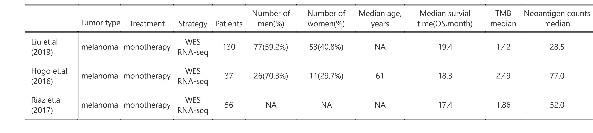
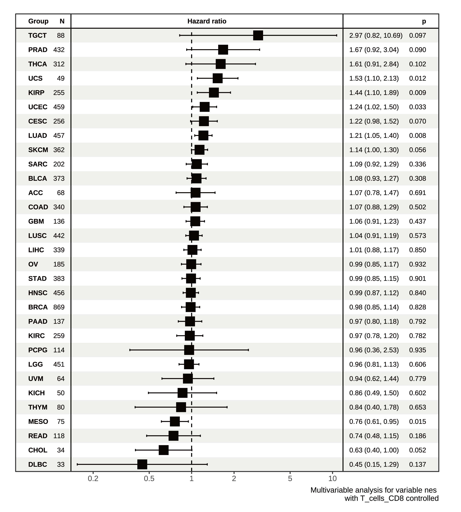

```{r Supplementary_analyses-setup, include=FALSE}
options(max.print = "75")
knitr::opts_chunk$set(echo = TRUE, comment = "#>", eval = TRUE, collapse = TRUE,cache = FALSE)
knitr::opts_knit$set(width = 75)
```

```{r lib4,echo=TRUE,eval=TRUE,include=FALSE}
library(tidyverse)
library(ggpubr)
library(cowplot)
library(viridis)
library(NeoEnrichment)
library(gridGraphics)
library(survminer)
library(survival)
```

## Sample statistics

Let's see the TCGA sample counts distribution and sample that has at least one neoantigen (ie can be used to calculated NES values) distribution by cancer types:

```{r tcga_samples_statics,eval=FALSE,message=FALSE,warning=FALSE}
library("ggcharts")
pancancer_neo_exp_ccf <- readRDS("~/Immunoediting/data/pancancer_neoantigen_exp_ccf.rds")
pancancer_neo_exp_ccf %>%
  group_by(Tumor_Barcode) %>%
  summarise(mt_counts=n(),
            neo_counts=sum(MT_har_mean<500)) %>%
  mutate(cancer_type=getcancer_type(Tumor_Barcode)) -> sample_summ

sample_summ %>%
  group_by(cancer_type) %>%
  summarise(sample_counts=n(),
            sample_with_neoantigen_counts=sum(neo_counts>0)) -> cancer_summ

cancer_summ <- cancer_summ %>% arrange(sample_counts)
cancer_summ$cancer_type <- factor(cancer_summ$cancer_type,levels = cancer_summ$cancer_type)

cancer_summ %>%
  dplyr::rename(`All sample`=sample_counts,
                `Sample with >= 1 neoantigens`=sample_with_neoantigen_counts) %>%
  pivot_longer(cols = c("All sample","Sample with >= 1 neoantigens"),
               names_to="type",
               values_to="counts") -> cancer_summ_longer
cancer_summ_longer <- cancer_summ_longer %>%
  mutate(cancer_type=gsub("TCGA-","",cancer_type))

p1 <- pyramid_chart(data = cancer_summ_longer, x = cancer_type, y = counts, group = type)

#save_plot("~/Immunoediting/results/tcga_samples.pdf", p1,base_width = 10,base_height = 6)
```

```{r view_1,eval=TRUE,warning=FALSE}


```

For the samples we focused on (NES(CCF)<0 significantly or escape), we can view it distribution by cancer type:

```{r view_focused,eval=FALSE}
pancancer_exp <- readRDS("~/Immunoediting/data/pancancer_nes_exp.rds") %>%
  mutate(p_adj=p.adjust(p_value,method = "fdr")) %>%
  mutate(es_type=case_when(
    nes < 0 & p_adj < 0.25 ~ "sig_negative",
    nes < 0 & p_adj >= 0.25 ~ "negative but not sig",
    nes >= 0 ~ "positive"
  ))

pancancer_exp$escape <- mapply(function(x,y,z)
  {case_when(
    NA %in% c(x,y,z) & any(c(x,y,z)=="yes",na.rm = T) ~ "yes",
    NA %in% c(x,y,z) & all(c(x,y,z)=="no",na.rm = T) ~ "NA",
    !(NA %in% c(x,y,z)) & any(c(x,y,z)=="yes",na.rm = T) ~ "yes",
    !(NA %in% c(x,y,z)) & all(c(x,y,z)=="no",na.rm = T) ~ "no"
  )},
  pancancer_exp$apm_mut,
  pancancer_exp$checkpoint_overexpression,
  pancancer_exp$exp_escape)
pancancer_exp <- pancancer_exp %>% 
  filter(escape!="NA")

pancancer_ccf <- readRDS("~/Immunoediting/data/pancancer_nes_ccf.rds") %>%
  mutate(p_adj=p.adjust(p_value,method = "fdr")) %>%
  mutate(es_type=case_when(
    nes < 0 & p_adj < 0.25 ~ "sig_negative",
    nes < 0 & p_adj >= 0.25 ~ "negative but not sig",
    nes >= 0 ~ "positive"
  ))

pancancer_ccf$cancer <- gsub("TCGA-","",getcancer_type(pancancer_ccf$sample))
pancancer_exp$cancer <- gsub("TCGA-","",getcancer_type(pancancer_exp$sample))
ccf_sig <- pancancer_ccf %>% 
  filter(es_type=="sig_negative") %>%
  dplyr::group_by(cancer) %>% 
  summarise(counts=n()) %>% 
  arrange(counts) %>%
  mutate(cancer=factor(cancer,levels = cancer)) %>%
  mutate(`Sample proportion`= counts/190) %>%
  mutate(label=paste("frac(",counts,",190)",sep = ""))

exp_sig <- pancancer_exp %>% 
  filter(escape=="yes") %>%
  group_by(cancer) %>% 
  summarise(counts=n()) %>% 
  arrange(counts) %>%
  mutate(cancer=factor(cancer,levels = cancer)) %>%
  mutate(`Sample proportion`=counts/5153) %>%
  mutate(label=paste("frac(",counts,",5153)",sep = ""))
p1 <- ggplot(data=exp_sig,aes(x=cancer,y=`Sample proportion`))+
  geom_bar(mapping = aes(x=cancer,y=`Sample proportion`),stat = "identity")+
  theme_classic()+
  theme(axis.text.x = element_text(angle = 45, vjust = 1, hjust = 1))+
  scale_y_continuous(expand = expansion(mult = c(0, .1)))+##remove blank in the bottom
  theme(axis.title.x=element_blank())+
  geom_text(aes(label=label), position=position_dodge(width=0.9), vjust=-0.25,size=2,parse=TRUE)
p2 <- ggplot(data=ccf_sig,aes(x=cancer,y=`Sample proportion`))+
  geom_bar(mapping = aes(x=cancer,y=`Sample proportion`),stat = "identity")+
  theme_classic()+
  theme(axis.text.x = element_text(angle = 45, vjust = 1, hjust = 1))+
  scale_y_continuous(expand = expansion(mult = c(0, .1)))+##remove blank in the bottom
  theme(axis.title.x=element_blank())+
  geom_text(aes(label=label),position=position_dodge(width=0.9),vjust=-0.25,size=2.5,parse=TRUE)

# plot_res <- plot_grid(p1,p2,nrow = 2)
# 
# save_plot("~/Immunoediting/results/sig_sample_distribution.pdf", plot_res, nrow = 2,ncol = 1,
#           base_height = 6)
```

```{r view_2,eval=TRUE,warning=FALSE}


```

Then we can also view the immunotherapy dataset composition：

```{r table,eval=FALSE}
gt_input <- tibble(
  cohort=c("Liu et.al \n (2019)","Hogo et.al \n (2016)","Riaz et.al \n (2017)"),
  `Tumor type`=c("melanoma","melanoma","melanoma"),
  Treatment=c("monotherapy","monotherapy","monotherapy"),
  Strategy=c("WES RNA-seq","WES RNA-seq","WES RNA-seq"),
  Patients=c(130,37,56),
  `Number of men(%)`=c("77(59.2%)","26(70.3%)",NA),
  `Number of women(%)`=c("53(40.8%)","11(29.7%)",NA),
  `Median age, years`=c(NA,61,NA),
  `Median survial time(OS,month)`=c(19.4,18.3,17.4),
  `TMB median`=c(1.42,2.49,1.86),
  `Neoantigen counts median`=c(28.5,77,52)
)

library(gt)
gt_tbl <- gt(data = gt_input)
gt_input %>%
  gt(rowname_col = "cohort") %>%
  cols_align(
    align = "center"
  ) -> gt_tbl
gtsave(gt_tbl,
  "immunotherapy_table.png", expand = 10,
  path = "~/Immunoediting/results/"
)
```

```{r view_immune_table,eval=TRUE,warning=FALSE}


```

## Multivariate cox analysis

We do multivariate cox analysis for NES ccf adding immune CD8 T cells as cofactor.

```{r multivariate_cox,eval=FALSE,message=FALSE}
library(survival)
library(survminer)
###ccf
pancancer_ccf <- readRDS("~/Immunoediting/data/pancancer_nes_ccf.rds") %>%
  mutate(p_adj=p.adjust(p_value,method = "fdr")) %>%
  mutate(es_type=case_when(
    nes < 0 & p_adj < 0.25 ~ "sig_negative",
    nes < 0 & p_adj >= 0.25 ~ "negative but not sig",
    nes >= 0 ~ "positive"
  ))
pancancer_survial <- readRDS("~/Immunoediting/data/pancancer_survial.rds")
pancancer_ccf <- left_join(pancancer_ccf %>%
                                      mutate(sample=substr(sample,1,12)),
                                    pancancer_survial,by="sample") %>% filter(OS.time<3500)
library(ezcox)
immue_estimate <- readRDS("~/Immunoediting/data/immue_estimate.rds")
pancancer_ccf$`cancer type` <- gsub("TCGA-","",getcancer_type(pancancer_ccf$sample))

pancancer_ccf <- left_join(pancancer_ccf,
                           immue_estimate %>% mutate(sample=substr(sample,1,12)),
                           by="sample") %>% distinct(sample,.keep_all = T)
p <- ezcox_group(pancancer_ccf,
            grp_var = "cancer type", covariate = "nes",controls = "T_cells_CD8",
            time = "OS.time", status = "OS",sort=T)
#save_plot("~/Immunoediting/results/cox_cancertype_ccf.pdf",p$plot,base_height = 8,base_width = 7)
```

We can compare this plot to previous plot of pancancer NES distribution:

```{r review_plot,eval=FALSE}
pancancer_simulation <- readRDS("~/Immunoediting/data/simulation/pancancer_simulation.rds")
pancancer_nes_ccf <- readRDS("~/Immunoediting/data/pancancer_nes_ccf.rds") 

##load function
source("~/Immunoediting/code/R/plot_pancancer_nes_distribution.R")
pancancer_simulation$cancer <- gsub("TCGA-","",pancancer_simulation$cancer)
pancancer_nes_ccf$cancer <- gsub("TCGA-","",getcancer_type(pancancer_nes_ccf$sample))
p1 <- plot_pancancer(pancancer_nes_ccf,pancancer_simulation,text_position = 4,size=3)
p1
```

```{r view_3,eval=TRUE,warning=FALSE,out.width=400}

knitr::include_graphics("pancancer_compare.png",dpi = 800)
```

```{r view_4,eval=TRUE}

```


From cancer type, we can know that there are 9 cancer types have no significant p value, including : DLBC,CHOL,KIRC,PAAD,PRAD,MESO,PCPG,UVM,KICH. And HR of most of those cancer type (8/9) in the multivariate cox analysis plot are less than 1 (bottom of the plot).

## Escape samples exploration


```{r compare_escape_tmb,eval=TRUE}
pancancer_neo_exp_ccf <- readRDS("~/Immunoediting/data/pancancer_neoantigen_exp_ccf.rds")
tmb_neocounts <- pancancer_neo_exp_ccf %>%
  rename(sample=Tumor_Barcode) %>%
  group_by(sample) %>%
  summarise(TMB=log((n()/38)+1),
            neo_counts=sum(MT_har_mean<500),
            neo_per=neo_counts/n())

pancancer_ccf <- readRDS("~/Immunoediting/data/pancancer_nes_ccf.rds")

pancancer_exp <- readRDS("~/Immunoediting/data/pancancer_nes_exp.rds")
pancancer_exp$escape <- mapply(function(x,y,z)
  {case_when(
    NA %in% c(x,y,z) & any(c(x,y,z)=="yes",na.rm = T) ~ "yes",
    NA %in% c(x,y,z) & all(c(x,y,z)=="no",na.rm = T) ~ "NA",
    !(NA %in% c(x,y,z)) & any(c(x,y,z)=="yes",na.rm = T) ~ "yes",
    !(NA %in% c(x,y,z)) & all(c(x,y,z)=="no",na.rm = T) ~ "no"
  )},
  pancancer_exp$apm_mut,
  pancancer_exp$checkpoint_overexpression,
  pancancer_exp$exp_escape)
pancancer_exp <- pancancer_exp %>% 
  filter(escape!="NA")

pancancer_exp <- left_join(pancancer_exp %>% 
                             select(sample,escape),
                           pancancer_ccf %>% 
                             mutate(sample=substr(sample,1,12)),
                           by="sample") %>% 
  filter(!is.na(escape)) %>% filter(!is.na(nes)) %>% 
  mutate(escape=ifelse(escape=="yes","escape","no escape"))
p1 <- ggplot(data = pancancer_exp,mapping = aes(x=escape,y=nes,fill=escape))+
  geom_violin(width=1)+
  geom_boxplot(width=0.2)+
  theme_classic()+
  stat_compare_means()+
  guides(fill=F)+
  theme(axis.title.x=element_blank())

pancancer_exp <- left_join(pancancer_exp,
                                    tmb_neocounts%>% 
                             mutate(sample=substr(sample,1,12)),
                                    by="sample")

p2 <- ggplot(data = pancancer_exp,mapping = aes(x=escape,y=TMB,fill=escape))+
  geom_violin(width=1)+
  geom_boxplot(width=0.15)+
  theme_classic()+
  stat_compare_means()+
  guides(fill=F)+
  theme(axis.title.x=element_blank())

p3 <- ggplot(data = pancancer_exp,mapping = aes(x=escape,y=log(neo_counts+1),fill=escape))+
  geom_violin(width=1)+
  geom_boxplot(width=0.25)+
  theme_classic()+
  stat_compare_means()+
  guides(fill=F)+
  theme(axis.title.x=element_blank())

p1
p2
p3
# plot_res <- plot_grid(p1,p2,p3,nrow = 3)
# save_plot("~/Immunoediting/results/compare_escape_tmb_neo_nes.pdf", plot_res, 
#           nrow = 3, ncol = 1)
```

This result shows that escape samples have lower NES(ccf) and higher mutation burden and neoantigen burden. The escape samples get rid of immune surveillance (ie the neoantigens can not been seen by immune system), thus accumulate more mutations and neoantigens. The lower NES may indicates that sample escaped after it experienced a strong immune pressure.

## Supplementary survial analysis

We further do the survial analysis of samples stratified by CD8 T cells infiltration directly (not by cancer type).

```{r cd8_tcelss,eval=TRUE}

###ccf
pancancer_ccf <- readRDS("~/Immunoediting/data/pancancer_nes_ccf.rds") %>%
  mutate(p_adj=p.adjust(p_value,method = "fdr")) %>%
  mutate(es_type=case_when(
    nes < 0 & p_adj < 0.25 ~ "sig_negative",
    nes < 0 & p_adj >= 0.25 ~ "negative but not sig",
    nes >= 0 ~ "positive"
  ))
pancancer_survial <- readRDS("~/Immunoediting/data/pancancer_survial.rds")
pancancer_ccf <- left_join(pancancer_ccf %>%
                                      mutate(sample=substr(sample,1,12)),
                                    pancancer_survial,by="sample") %>% filter(OS.time<3300)
immue_estimate <- readRDS("~/Immunoediting/data/immue_estimate.rds")
pancancer_ccf$`cancer type` <- getcancer_type(pancancer_ccf$sample)

pancancer_ccf <- left_join(pancancer_ccf,
                           immue_estimate %>% mutate(sample=substr(sample,1,12)),
                           by="sample") %>% distinct(sample,.keep_all = T) 
pancancer_ccf <- pancancer_ccf %>% 
  filter(!is.na(T_cells_CD8)) %>% 
  mutate(immune_type=ifelse(T_cells_CD8<median(T_cells_CD8),"cold","hot"))


fit0 <- survfit(Surv(OS.time,OS)~es_type,data = pancancer_ccf %>% 
                  filter(es_type!="negative but not sig"))
p0 <- ggsurvplot(fit0,pval = T,risk.table = T,data = pancancer_ccf %>% 
                   filter(es_type!="negative but not sig"),
                  tables.theme = theme_cleantable(),  # Clean risk table
                  palette =c( "black","red"),
                  size=2,title="CCF hot", fun = "pct",
                 legend = c(0.8, 0.9), legend.title = element_blank(),
                 legend.labs = c("NES > 0", "NES < 0 & FDR < 25% "))


hot <- pancancer_ccf %>% filter(immune_type=="hot")
fit1 <- survfit(Surv(OS.time,OS)~es_type,data = hot %>% filter(es_type!="negative but not sig"))
p1 <- ggsurvplot(fit1,pval = T,risk.table = T,data = hot %>% filter(es_type!="negative but not sig"),
                  tables.theme = theme_cleantable(),  # Clean risk table
                  palette =c( "black","red"),
                  size=2,title="CCF hot", fun = "pct",
                 legend = c(0.8, 0.9), legend.title = element_blank(),
                 legend.labs = c("NES > 0", "NES < 0 & FDR < 25% "))

cold <- pancancer_ccf %>% filter(immune_type=="cold")
fit2 <- survfit(Surv(OS.time,OS)~es_type,data = cold %>% filter(es_type!="negative but not sig"))
p2 <- ggsurvplot(fit2,pval = T,risk.table = T,
                 data = cold %>% filter(es_type!="negative but not sig"),
                 tables.theme = theme_cleantable(),  # Clean risk table
                 palette =c( "black","red"),
                 size=2,title="CCF cold", fun = "pct",
                 legend = c(0.8, 0.9), legend.title = element_blank(),
                 legend.labs = c("NES > 0", "NES < 0 & FDR < 25% "))

p0
p1
p2

# plot_res <- arrange_ggsurvplots(list(p0,p1,p2),nrow = 2,2)
# 
# save_plot("~/Immunoediting/results/survial_ccf_immune_cd8.pdf", plot_res, nrow = 2,ncol = 2,base_width = 12,base_height = 8)

###escape
pancancer_exp <- readRDS("~/Immunoediting/data/tmp_exp.rds")
pancancer_exp <- left_join(pancancer_exp,
                           immue_estimate %>% mutate(sample=substr(sample,1,12)),
                           by="sample") %>% distinct(sample,.keep_all = T) %>% 
  filter(!is.na(T_cells_CD8)) %>% 
  mutate(immune_type=ifelse(T_cells_CD8<median(T_cells_CD8),"cold","hot"))

fit3 <- survfit(Surv(OS.time,OS)~escape,data = pancancer_exp)
p3 <- ggsurvplot(fit3,pval = T,risk.table = T,data = pancancer_exp,
                  tables.theme = theme_cleantable(),  # Clean risk table
                  palette =c("black","red"),
                  size=2,title="Escape of all samples", fun = "pct",
                 legend = c(0.8, 0.9), legend.title = element_blank(),
                 legend.labs = c("NO escape", "Escape"))

hot <- pancancer_exp %>% filter(immune_type=="hot")
fit4 <- survfit(Surv(OS.time,OS)~escape,data = hot)
p4 <- ggsurvplot(fit4,pval = T,risk.table = T,data = hot,
                  tables.theme = theme_cleantable(),  # Clean risk table
                  palette =c("black","red"),
                  size=2,title="Escape of hot cancers", fun = "pct",
                 legend = c(0.8, 0.9), legend.title = element_blank(),
                 legend.labs = c("NO escape", "Escape"))

cold <- pancancer_exp %>% filter(immune_type=="cold")
fit5 <- survfit(Surv(OS.time,OS)~escape,data = cold)
p5 <- ggsurvplot(fit5,pval = T,risk.table = T,data = cold,
                  tables.theme = theme_cleantable(),  # Clean risk table
                  palette =c("black","red"),
                  size=2,title="Escape of cold cancers", fun = "pct",
                 legend = c(0.8, 0.9), legend.title = element_blank(),
                 legend.labs = c("NO escape", "Escape"))

p3
p4
p5

# plot_res <- arrange_ggsurvplots(list(p3,p4,p5),nrow = 2,2)
# 
# save_plot("~/Immunoediting/results/survial_escape_immune_cd8.pdf", plot_res, nrow = 2,ncol = 2,base_width = 12,base_height = 8)
```


