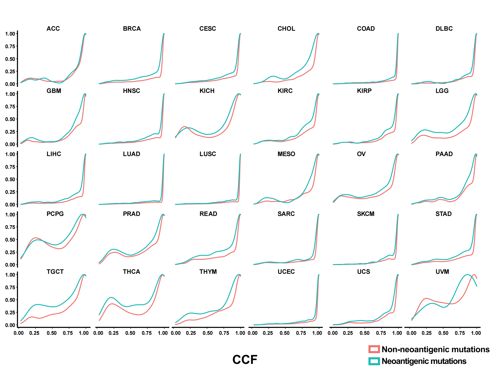

```{r Supplementary_analyses-setup, include=FALSE}
options(max.print = "75")
knitr::opts_chunk$set(echo = TRUE, comment = "#>", eval = TRUE, collapse = TRUE,cache = FALSE)
knitr::opts_knit$set(width = 75)
```

```{r lib4,echo=TRUE,eval=TRUE,include=FALSE,message=FALSE}
library(dplyr)
library(tidyr)
library(NeoEnrichment)
library(ggplot2)
library(ggcharts)
library(stringr)
library(maftools)
library(ComplexHeatmap)
library(readr)
library(gt)
```

## Sample statistics and clinical features

Number of the patient with CCF information and number of patient with at least one neoantigenic mutation and subclonal mutation (CCF<0.6) are shown for each cancer type and number of the patient with mRNA expression information and number of patient with at least one neoantigenic mutation and accompanied mRNA expression information are shown for each cancer type:

```{r}
###sample statistics
all_mut_ccf <- readRDS("../data/all_mut_ccf_tpm.rds")
all_mut_ccf <- all_mut_ccf %>%
  rename(ccf=ccf_hat) %>%
  mutate(neo=ifelse(neo=="neo","yes","no"))
samples_has_subclonal <- all_mut_ccf %>% filter(ccf<0.6) %>% select(sample) %>%
  distinct(sample)
all_mut_ccf %>%
  group_by(sample) %>%
  summarise(c_n=sum(neo=="yes"),c_m=sum(neo=="no")) %>%
  mutate(type=ifelse(sample %in% samples_has_subclonal$sample,"yes","no")) -> sample_summ
sample_summ$cancer <- get_cancer_type(sample_summ$sample)
sample_summ %>%
  group_by(cancer) %>%
  summarise(sample_counts=n(),
            sample_with_neoantigen_counts=sum(c_n>=1 & c_m >=1 & type=="yes")) -> cancer_summ

cancer_summ <- cancer_summ %>% arrange(sample_counts)
cancer_summ$cancer <- factor(cancer_summ$cancer,levels = cancer_summ$cancer)

cancer_summ %>%
  dplyr::rename(`All samples`=sample_counts,
                `Samples with >= 1 neoantigen and have subclonal mutations`=sample_with_neoantigen_counts) %>%
  pivot_longer(cols = c("All samples","Samples with >= 1 neoantigen and have subclonal mutations"),
               names_to="type",
               values_to="counts") -> cancer_summ_longer

p1 <- pyramid_chart(data = cancer_summ_longer, x = cancer, y = counts, group = type)


all_mut_exp <- readRDS("../data/all_mut_tpm_not_filter.rds")
all_mut_exp %>%
  group_by(sample) %>%
  summarise(n_a=sum(neo=="not_neo"),n_c=sum(neo=="neo")) -> sample_summ
sample_summ$cancer <- get_cancer_type(sample_summ$sample)
sample_summ %>%
  group_by(cancer) %>%
  summarise(sample_counts=n(),
            sample_with_neoantigen_counts=sum(n_a>=1 & n_c >=1)) -> cancer_summ

cancer_summ <- cancer_summ %>% arrange(sample_counts)
cancer_summ$cancer <- factor(cancer_summ$cancer,levels = cancer_summ$cancer)

cancer_summ %>%
  dplyr::rename(`All samples`=sample_counts,
                `Samples with >= 1 neoantigen`=sample_with_neoantigen_counts) %>%
  pivot_longer(cols = c("All samples","Samples with >= 1 neoantigen"),
               names_to="type",
               values_to="counts") -> cancer_summ_longer

p2 <- pyramid_chart(data = cancer_summ_longer, x = cancer, y = counts, group = type)

p1 
p2
```

We also calculated the significant sample in each cancer type:

```{r}
pancancer_ccf <- readRDS("../data/neo_nes_ccf06_1_remove_driver_samples_addp.rds") %>%
  mutate(es_type=ifelse(es<0 & p <0.05,"sig_neg","others"))
pancancer_exp <- readRDS("../data/nes_exp_addp.rds") %>%
  mutate(es_type=ifelse(es<0 & p_value <0.05,"sig_neg","others"))
pancancer_ccf$cancer <- get_cancer_type(pancancer_ccf$sample)
pancancer_exp$cancer <- get_cancer_type(pancancer_exp$sample)

get_plot <- function(dt,total_sig_sample){
  sig <- dt %>%
    filter(es_type=="sig_neg") %>%
    dplyr::group_by(cancer) %>%
    summarise(counts=n()) %>%
    arrange(counts) %>%
    mutate(cancer=factor(cancer,levels = cancer)) %>%
    mutate(`Sample proportion`= counts/total_sig_sample) %>%
    mutate(label=paste("frac(",counts,",",total_sig_sample,")",sep = ""))

  p1 <- ggplot(data=sig,aes(x=cancer,y=`Sample proportion`))+
    geom_bar(mapping = aes(x=cancer,y=`Sample proportion`),stat = "identity")+
    theme_classic()+
    theme(axis.text.x = element_text(angle = 45, vjust = 1, hjust = 1))+
    scale_y_continuous(expand = expansion(mult = c(0, .1)))+##remove blank in the bottom
    theme(axis.title.x=element_blank())+
    geom_text(aes(label=label), position=position_dodge(width=0.9), vjust=-0.25,size=2,parse=TRUE)
  return(p1)

}

get_plot(pancancer_ccf,sum(pancancer_ccf$es_type=="sig_neg"))
get_plot(pancancer_exp,sum(pancancer_exp$es_type=="sig_neg"))
```

Pan-cancer sample distribution in pie plot:

```{r}
pancancer_ccf <- pancancer_ccf %>%
  mutate(es_type2=ifelse(es<0 & p<0.05,"ES < 0 & P < 0.05","Others"))
pancancer_exp <- pancancer_exp %>%
  mutate(es_type2=ifelse(es<0 & p_value<0.05,"ES < 0 & P < 0.05","Others"))

ccf_es <- pancancer_ccf$es
ccf_es1 <- pancancer_ccf$es_type2
par(mfrow=c(4,1))
op <- par(mar = rep(0, 4))
plot_pie(ccf_es,expression = "ccf_es<0",c("ES (CCF) < 0","ES (CCF) >= 0"))
plot_pie(ccf_es1,expression = "ccf_es1=='ES < 0 & P < 0.05'",c("ES (CCF) < 0 & P < 0.05","Others"))

exp_es <- pancancer_exp$es
exp_es1 <- pancancer_exp$es_type2
plot_pie(exp_es,expression = "exp_es<0",c("ES (EXP) < 0","ES (EXP) >= 0"))
plot_pie(exp_es1,expression = "exp_es1=='ES < 0 & P < 0.05'",c("ES (EXP) < 0 & P < 0.05","Others"))
```

The immune-thearpy dataset sample distribution and clinical parameters:

```{r eval=FALSE}
all_sample_exp_ccf <- readRDS("../data/Immunotherapy/all_mut_ccf_ici.rds")
ccf <- all_sample_exp_ccf %>% filter(!is.na(cancer_cell_frac))
exp <- all_sample_exp_ccf %>% filter(!is.na(exp))

all_sample <- union(names(table(ccf$sample)),names(table(exp$sample)))
both <- intersect(names(table(ccf$sample)),names(table(exp$sample)))
WES <- setdiff(names(table(ccf$sample)),names(table(exp$sample)))
RNA <- setdiff(names(table(exp$sample)),names(table(ccf$sample)))
all_clinical <- readRDS("../data/Immunotherapy/all_clinical.rds")

response <- all_clinical %>% filter(response2=="response")
no_response <- all_clinical %>% filter(response2!="response")

willy_tre <- read_csv("../data/Immunotherapy/willy_clinical.csv") %>%
  select(`Patient ID`,Treatment,Gender,Age) %>%
  rename(sample=`Patient ID`) %>% mutate(sample=paste("willy_",sample,sep = "")) %>% na.omit()
##nadeem Nivolumab
nadeem_tre <- data.frame(sample=all_sample[grepl("nadeem_",all_sample)],Treatment="Nivolumab",
                         Gender=NA,Age=NA,stringsAsFactors = F)
liu_clinical <- readRDS("../data/Immunotherapy/liu_clinical.rds") %>%
  select(X,Tx,`gender..Male.1..Female.0.`) %>%
  mutate(Gender=ifelse(`gender..Male.1..Female.0.`==1,"M","F")) %>%
  select(-`gender..Male.1..Female.0.`) %>% mutate(Age=NA) %>%
  rename(sample=X,Treatment=Tx) %>% mutate(sample=paste0("liu_",sample)) %>% filter(grepl("_Patient",sample))
all_tre <- bind_rows(list(willy_tre,nadeem_tre,liu_clinical))
saveRDS(all_tre,file = "../data/Immunotherapy/all_treatment.rds")
dt <- data.frame(sample=all_sample,
                 stringsAsFactors = F) %>%
  mutate(`Data type`= case_when(
    sample %in% both ~ "Both",
    sample %in% WES ~ "WES",
    sample %in% RNA ~ "RNA-Seq"
  )) %>%
  mutate(Response=ifelse(sample %in% response$sample,"Responder","Non-Responder")) %>%
  mutate(cohort=gsub("_.*","",sample)) %>%
  left_join(.,all_tre,by="sample")
dt <- dt %>% arrange(sample)

dt_cli <- left_join(dt,all_clinical,by="sample")

cohort_col <- RColorBrewer::brewer.pal(3,"Accent")
data_type_col <- RColorBrewer::brewer.pal(3,"Dark2")
Response_col <- RColorBrewer::brewer.pal(3,"Set1")[1:2]
Treatment_col <- RColorBrewer::brewer.pal(3,"Paired")
ha = HeatmapAnnotation(
  Cohort=dt$cohort,
  `Data type` = dt$`Data type`,
  Response = dt$Response,
  Treatment=dt$Treatment,
  col = list(Cohort=c("liu"=cohort_col[1],"nadeem"=cohort_col[2],"willy"=cohort_col[3]),
             `Data type` = c("WES" =data_type_col[1], "RNA-Seq" = data_type_col[2],"Both"=data_type_col[3]),
             Response = c("Responder"=Response_col[1],"Non-Responder"=Response_col[2]),
             Treatment=c("Nivolumab"=Treatment_col[1],"Pembrolizumab"=Treatment_col[2])),
  annotation_name_side="left",height = unit(300, "cm"),width = unit(20, "cm")
)

lgd1 = Legend(labels = c("liu","nadeem","willy"), legend_gp = gpar(fill=c(cohort_col[1],cohort_col[2],cohort_col[3])),
              title = "Cohort", ncol = 3)
lgd2 = Legend(labels = c("WES","RNA-Seq","Both"), legend_gp = gpar(fill=c(data_type_col[1],data_type_col[2],data_type_col[3])),
              title = "Data type", ncol = 3)
lgd3 = Legend(labels = c("Responder","Non-Responder"), legend_gp = gpar(fill=c(Response_col[1],Response_col[2])),
              title = "Response", ncol = 2)
lgd4 = Legend(labels = c("Nivolumab","Pembrolizumab"), legend_gp = gpar(fill=c(Treatment_col[1],Treatment_col[2],Treatment_col[3])),
              title = "Treatment", ncol = 2)
draw(ha, test = T)
pd = packLegend(lgd1, lgd2,lgd3,lgd4)
draw(pd,x = unit(14, "cm"), y = unit(6, "cm"), just = c("left", "bottom"))

```

```{r eval=TRUE,warning=FALSE}

knitr::include_graphics("sample_statistics.png")
```

```{r eval=FALSE}
all_sample_exp_ccf <- left_join(all_sample_exp_ccf,dt_cli,by="sample")
all_sample_exp_ccf %>% group_by(sample) %>% summarise(TMB=log((n()/38)+1)) %>%
  left_join(.,dt_cli,by="sample") %>% filter(!is.na(cohort)) -> all_tmb

all_tmb %>% group_by(cohort) %>% summarise(tmb_median=median(TMB),tmb_min=min(TMB),max_tmb=max(TMB))
all_sample_exp_ccf %>% filter(!is.na(cohort)) %>%
  group_by(sample) %>% summarise(neo_counts=sum(neo=="neo")) %>%
  left_join(.,dt_cli,by="sample")-> all_neo
all_neo %>% group_by(cohort) %>% summarise(median_neo=median(neo_counts))
########表格####
gt_input <- tibble(
  cohort=c("Liu et.al \n (2019)","Hogo et.al \n (2016)","Riaz et.al \n (2017)"),
  `Tumor type`=c("melanoma","melanoma","melanoma"),
  Treatment=c("monotherapy","monotherapy","monotherapy"),
  Strategy=c("WES RNA-seq","WES RNA-seq","WES RNA-seq"),
  Patients=c(130,37,56),
  `Number of men(%)`=c("77(59.2%)","26(70.3%)",NA),
  `Number of women(%)`=c("53(40.8%)","11(29.7%)",NA),
  `Median age, years`=c(NA,61,NA),
  `Median survial time(OS,month)`=c(19.4,18.3,17.4),
  `TMB median`=c(1.42,2.49,1.86),
  `Neoantigen counts median`=c(28.5,77,52)
)

gt_tbl <- gt(data = gt_input)
gt_input %>%
  gt(rowname_col = "cohort") %>%
  cols_align(
    align = "center"
  ) -> gt_tbl
gridExtra::grid.table(gt_input)
```

```{r eval=TRUE,warning=FALSE}
knitr::include_graphics("sample_table.png")
```


```{r}
#####oncoprint############
##liu
liu_mutations <- readRDS("../data/Immunotherapy/liu_mutations.rds")
liu_mutations <- liu_mutations %>% mutate(change=str_extract(cDNA_Change,"[A-Z]>[A-Z]")) %>%
  mutate(Tumor_Seq_Allele2=gsub(">","",str_extract(change,">[A-Z]"))) %>%
  mutate(Reference_Allele=gsub(">","",str_extract(change,"[A-Z]>"))) %>%
  rename(Tumor_Sample_Barcode=Patient)
liu_clinical <- readRDS("../data/Immunotherapy/liu_clinical.rds") %>%
  filter(grepl("Patient",X)) %>%
  select(X,OS,dead) %>%
  rename(Tumor_Sample_Barcode=X,Overall_Survival_time=OS,Overall_Survival_Status=dead)
liu <- read.maf(maf = liu_mutations,
                clinicalData = liu_clinical,
                verbose = FALSE)
oncoplot(maf = liu,top=10,draw_titv = TRUE)

##willy
files <- list.files("../data/Immunotherapy/willy/",full.names = T)
willy_maf <- merge_mafs(mafs = files)
oncoplot(maf = willy_maf,top=10,draw_titv = TRUE)

###nadeem
files <- list.files("../data/Immunotherapy/nadeem/",full.names = T)
nadeem_maf <- merge_mafs(mafs=files)
oncoplot(maf = nadeem_maf,top=10,draw_titv = TRUE)
```

## Immune escape analysis

We consider the following immune escape mechanisms: 

1. Suppress the transcription of genome alterations encoding high antigenicity (quantified as ESRNA); 
2. Antigen presentation pathway gene alterations; 
3. PD-L1 or CTLA-4 overexpression.

Antigen presentation pathway genes were selected based on the list of antigen processing and presentation machinery (APM) from the Gene Ontology Consortium (GO:0002474). Gene level non-silent mutation file was downloaded from UCSC Xena. If one sample has non-silent mutations in APM genes, then this sample was labled as escape by APM mutation.

Immune checkpoint gene overexpression was assessed using RNA-seq data. Normal expression values (in transcripts per million mapped reads (TPM)) of PD-L1 and CTLA-4 were established from the TCGA based on RNA-seq expression of the two proteins in normal samples. Checkpoint overexpression was called if either PD-L1 or CTLA-4 expression in the tumor was higher than the mean plus two standard deviations of normal expression:

```{r eval=FALSE}
library(tidyr)
####apm
apm_gene <- readRDS("data/ap_pathway.rds")
non_slient_mutation <- data.table::fread("~/data/mc3.v0.2.8.PUBLIC.nonsilentGene.xena",data.table = F)
apm_gene <- apm_gene$V1
which(!(apm_gene %in% non_slient_mutation$sample))
non_slient_mutation <- non_slient_mutation %>%
  dplyr::filter(sample %in% apm_gene) 
check <- apply(non_slient_mutation[,2:ncol(non_slient_mutation)],2,function(x){any(x==1)}) %>% as.data.frame()
colnames(check) <- "apm_mut"
check$sample <- rownames(check)
saveRDS(check,file = "data/apm_mut_sample.rds")
###checkpoint over expression CD274 CTLA-4
tpm_gene <- readRDS("~/data/tpm_trans.rds")
CD274 <- tpm_gene %>% filter(gene == "CD274") %>%
  select(c(3:ncol(tpm_gene))) %>% t() %>% as.data.frame()
CD274$sample <- rownames(CD274)
colnames(CD274)[1] <- "PDL1"
CTLA4 <- tpm_gene %>% filter(gene == "CTLA4") %>%
  select(c(3:ncol(tpm_gene))) %>% t() %>% as.data.frame()
CTLA4$sample <- rownames(CTLA4)
colnames(CTLA4)[1] <- "CTLA4"

check_point <- left_join(CD274,CTLA4,by="sample")
saveRDS(check_point,file = "data/checkpoint_exp.rds")
table(substr(check_point$sample,14,15))

normal <- data.frame(sample=colnames(tpm_gene)[which(substr(colnames(tpm_gene),14,15)==11)])
normal <- left_join(normal,check_point,by="sample")
normal$cancer <- EasyBioinfo::get_cancer_type(normal$sample)
normal %>%
  group_by(cancer) %>%
  summarise(mean_pdl1 = mean(PDL1),
            sd_pdl1 = sd(PDL1),
            mean_ctla4 = mean(CTLA4),
            sd_ctla4 = sd(CTLA4)) -> mean_sd

cancer <- check_point %>% 
  filter(as.numeric(substr(sample,14,15)) < 11)
cancer$cancer <- EasyBioinfo::get_cancer_type(cancer$sample)
cancer <- left_join(cancer,mean_sd,by="cancer")
cancer <- na.omit(cancer)

cancer <- cancer %>%
  mutate(PDL1_over = ifelse(PDL1 > (mean_pdl1+2*sd_pdl1),"yes","no"),
         CTLA4_over = ifelse(CTLA4 > (mean_ctla4+2*sd_ctla4),"yes","no")) 
saveRDS(cancer,file = "data/checkpoint_over.rds")
```

Then we can compare the ESccf between escape samples and no escape samples:
```{r}
nes_ccf <- readRDS("../data/neo_nes_ccf06_1_remove_driver_samples_addp.rds")
nes_exp <- readRDS("../data/nes_exp_addp.rds")

both <- left_join(
  nes_ccf,
  nes_exp %>% select(es,sample,p_value) %>% rename(es_exp=es,p_exp=p_value)
) %>% na.omit() %>% 
  mutate(exp_type=ifelse(es_exp<0 & p_exp<0.05,"escape","no_escape"))
##other escape mechanisms
checkpoint_over <- readRDS("../data/checkpoint_over.rds")
apm_mut_sample <- readRDS("../data/apm_mut_sample.rds")

inter_sample <- Reduce(intersect, list(checkpoint_over$sample,apm_mut_sample$sample,
                                       substr(both$sample,1,15)))
both_other <- Reduce(left_join,list(both %>% mutate(sample=substr(sample,1,15)) %>% 
                                      dplyr::filter(sample %in% inter_sample),
                                    checkpoint_over %>% select(sample,PDL1_over,CTLA4_over) %>% 
                                      dplyr::filter(sample %in% inter_sample),
                                    apm_mut_sample %>% dplyr::filter(sample %in% inter_sample)))
both_other <- both_other %>% 
  mutate(escape=ifelse(exp_type=="escape" | PDL1_over == "yes" | CTLA4_over == "yes" | apm_mut,"yes","no"))

ggplot(data=both_other,aes(x=escape,y=es))+
  geom_boxplot()+
  stat_compare_means()+
  labs(x="Escape",y="ESccf")+
  theme_prism()
# both_other$cancer <- EasyBioinfo::get_cancer_type(both_other$sample)
# saveRDS(both_other,file = "../data/all_escape_mech.rds")
```

We can get the simulation p value for pancancer and cancer types as previously described:

```{r}
sim_all <- readRDS("../../tmp/sim_2000_not_filter_all_ccf.rds")
neo_nes <- readRDS("../data/all_escape_mech.rds")
neo_nes$cancer <- EasyBioinfo::get_cancer_type(neo_nes$sample)
escape <- neo_nes %>% filter(escape=="yes")
no_escape <- neo_nes %>% filter(escape!="yes")
sim_escape <- sim_all %>% 
  filter(substr(sample,1,15) %in% escape$sample)
sim_no_escape <- sim_all %>% 
  filter(substr(sample,1,15) %in% no_escape$sample)

sim_escape %>%
  group_by(cancer,sim_num) %>%
  summarise(median_es=median(es)) -> summ1
escape_summ <- escape %>% 
  group_by(cancer) %>% summarise(median_es=median(es))
sim_escape %>%
  group_by(sim_num) %>%
  summarise(median_es=median(es)) -> summ2
p <- WVPlots::ShadedDensity(frame = summ2, 
                            xvar = "median_es",
                            threshold = median(escape$es),
                            title = "",
                            tail = "left")

p$layers[[1]]$aes_params$colour <- "red"
p$layers[[1]]$aes_params$size <- 1
p$layers[[2]]$aes_params$fill <- "blue"     #geom_ribbon
p$layers[[3]]$aes_params$colour <- "black" 
p$layers[[3]]$aes_params$size <- 1
p1 <- p + labs(x="Simulation median es")+
  theme_prism()+
  labs(y="Density")
p1

noescape_summ <- no_escape %>% 
  group_by(cancer) %>% summarise(median_es=median(es))
sim_no_escape %>%
  group_by(sim_num) %>%
  summarise(median_es=median(es)) -> summ3
p <- WVPlots::ShadedDensity(frame = summ3, 
                            xvar = "median_es",
                            threshold = median(no_escape$es),
                            title = "",
                            tail = "left")

p$layers[[1]]$aes_params$colour <- "red"
p$layers[[1]]$aes_params$size <- 1
p$layers[[2]]$aes_params$fill <- "blue"     #geom_ribbon
p$layers[[3]]$aes_params$colour <- "black" 
p$layers[[3]]$aes_params$size <- 1
p2 <- p + labs(x="Simulation median es")+
  theme_prism()+
  labs(y="Density")
p2

sim_no_escape %>%
  group_by(cancer,sim_num) %>%
  summarise(median_es=median(es)) -> summ4

noescape_summ <- noescape_summ %>%
  rowwise() %>%
  mutate(p=mean(summ4$median_es[summ4$cancer==cancer] <= median_es))
escape_summ <- escape_summ %>%
  rowwise() %>%
  mutate(p=mean(summ1$median_es[summ1$cancer==cancer] <= median_es))

escape <- escape %>% select(-p)
no_escape <- no_escape %>% select(-p)
p3 <- get_f1(escape,pancancer_p = 0.76,dt2 = escape_summ,median_es = median(escape$es))
p3

p4 <- get_f1(no_escape,pancancer_p = 0.019,dt2 = noescape_summ,median_es = median(no_escape$es))
p4

```

The result shows that immune elimination signal can be detected in samples without escape signal, while in samples with immunoediting escape mechanisms this signal is much weaker. ESCCF values of patients without immune escape mechanisms are significantly lower than patients with immune escape mechanisms. This data is consistent with our previous observation that there is anti-correlation between immunoediting elimination and escape signal. 

## CCF distribution analysis

As our method is relied on the distribution of CCF, we can show the CCF distribution of pancancer and all cancer types, plotting as well the CCF of neoantigen and non-neoantigens:

```{r eval=FALSE}
all_mut_ccf <- readRDS("../data/all_mut_ccf_tpm.rds") %>% as.data.frame()
all_mut_ccf <- all_mut_ccf %>%
  rename(ccf=ccf_hat) %>%
  mutate(neo=ifelse(neo=="neo","yes","no"))
es <- readRDS("../data/neo_nes_ccf06_1_remove_driver_samples_addp.rds")
neo_missense <- all_mut_ccf %>% 
  filter(sample %in% es$sample) %>% 
  select(sample,neo,ccf) %>% filter(!is.na(ccf))

neo_missense$cancer <- get_cancer_type(neo_missense$sample)

ggplot(data = neo_missense,aes(x=ccf,..scaled..,color=neo))+
  geom_density(size=1)+
  theme_prism()+
  labs(y="Density",x="CCF")+
  facet_wrap(. ~ cancer)
```

```{r eval=TRUE,warning=FALSE}

```

It is apparent that in many cancer types there are clear shift of CCF curves of neoantigenic mutations compared with non-neoantigenic mutations, and this difference highlight the immunoediting elimination signal quantified in this study.

