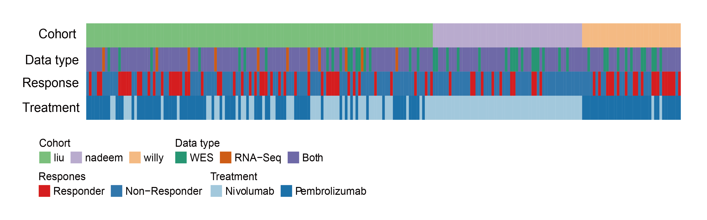
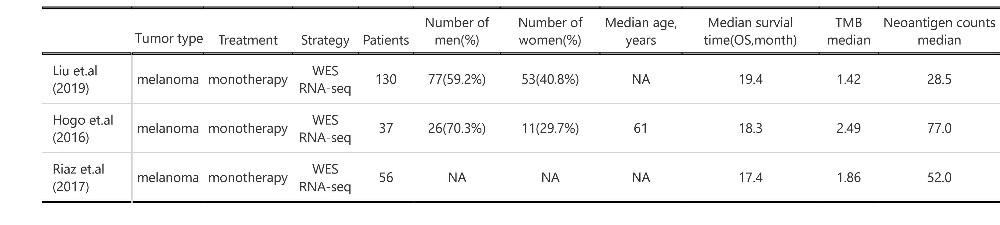

```{r Supplementary_analyses-setup, include=FALSE}
options(max.print = "75")
knitr::opts_chunk$set(echo = TRUE, comment = "#>", eval = TRUE, collapse = TRUE,cache = FALSE)
knitr::opts_knit$set(width = 75)
```

```{r lib4,echo=TRUE,eval=TRUE,include=FALSE,message=FALSE}
library(dplyr)
library(tidyr)
library(NeoEnrichment)
library(ggplot2)
library(ggcharts)
library(stringr)
library(maftools)
library(ComplexHeatmap)
library(readr)
library(gt)
library(ezcox)
```

## Sample statistics and clinical features

Number of the patient with CCF information and number of patient with at least one neoantigenic mutation and subclonal mutation (CCF<0.6) are shown for each cancer type and number of the patient with mRNA expression information and number of patient with at least one neoantigenic mutation and accompanied mRNA expression information are shown for each cancer type:

```{r}
###sample statistics
all_mut_ccf <- readRDS("../data/all_mut_ccf_tpm.rds")
all_mut_ccf <- all_mut_ccf %>%
  rename(ccf=ccf_hat) %>%
  mutate(neo=ifelse(neo=="neo","yes","no"))
samples_has_subclonal <- all_mut_ccf %>% filter(ccf<0.6) %>% select(sample) %>%
  distinct(sample)
all_mut_ccf %>%
  group_by(sample) %>%
  summarise(c_n=sum(neo=="yes"),c_m=sum(neo=="no")) %>%
  mutate(type=ifelse(sample %in% samples_has_subclonal$sample,"yes","no")) -> sample_summ
sample_summ$cancer <- get_cancer_type(sample_summ$sample)
sample_summ %>%
  group_by(cancer) %>%
  summarise(sample_counts=n(),
            sample_with_neoantigen_counts=sum(c_n>=1 & c_m >=1 & type=="yes")) -> cancer_summ

cancer_summ <- cancer_summ %>% arrange(sample_counts)
cancer_summ$cancer <- factor(cancer_summ$cancer,levels = cancer_summ$cancer)

cancer_summ %>%
  dplyr::rename(`All samples`=sample_counts,
                `Samples with >= 1 neoantigen and have subclonal mutations`=sample_with_neoantigen_counts) %>%
  pivot_longer(cols = c("All samples","Samples with >= 1 neoantigen and have subclonal mutations"),
               names_to="type",
               values_to="counts") -> cancer_summ_longer

p1 <- pyramid_chart(data = cancer_summ_longer, x = cancer, y = counts, group = type)


all_mut_exp <- readRDS("../data/all_mut_tpm_not_filter.rds")
all_mut_exp %>%
  group_by(sample) %>%
  summarise(n_a=sum(neo=="not_neo"),n_c=sum(neo=="neo")) -> sample_summ
sample_summ$cancer <- get_cancer_type(sample_summ$sample)
sample_summ %>%
  group_by(cancer) %>%
  summarise(sample_counts=n(),
            sample_with_neoantigen_counts=sum(n_a>=1 & n_c >=1)) -> cancer_summ

cancer_summ <- cancer_summ %>% arrange(sample_counts)
cancer_summ$cancer <- factor(cancer_summ$cancer,levels = cancer_summ$cancer)

cancer_summ %>%
  dplyr::rename(`All samples`=sample_counts,
                `Samples with >= 1 neoantigen`=sample_with_neoantigen_counts) %>%
  pivot_longer(cols = c("All samples","Samples with >= 1 neoantigen"),
               names_to="type",
               values_to="counts") -> cancer_summ_longer

p2 <- pyramid_chart(data = cancer_summ_longer, x = cancer, y = counts, group = type)

p1 
p2
```

We also calculated the significant sample in each cancer type:

```{r}
pancancer_ccf <- readRDS("../data/neo_nes_ccf06_1_remove_driver_samples_addp.rds") %>%
  mutate(es_type=ifelse(es<0 & p <0.05,"sig_neg","others"))
pancancer_exp <- readRDS("../data/es_exp_filter_driver.rds") %>%
  mutate(es_type=ifelse(es<0 & p_value <0.05,"sig_neg","others"))
pancancer_ccf$cancer <- get_cancer_type(pancancer_ccf$sample)
pancancer_exp$cancer <- get_cancer_type(pancancer_exp$sample)

get_plot <- function(dt,total_sig_sample){
  sig <- dt %>%
    filter(es_type=="sig_neg") %>%
    dplyr::group_by(cancer) %>%
    summarise(counts=n()) %>%
    arrange(counts) %>%
    mutate(cancer=factor(cancer,levels = cancer)) %>%
    mutate(`Sample proportion`= counts/total_sig_sample) %>%
    mutate(label=paste("frac(",counts,",",total_sig_sample,")",sep = ""))

  p1 <- ggplot(data=sig,aes(x=cancer,y=`Sample proportion`))+
    geom_bar(mapping = aes(x=cancer,y=`Sample proportion`),stat = "identity")+
    theme_classic()+
    theme(axis.text.x = element_text(angle = 45, vjust = 1, hjust = 1))+
    scale_y_continuous(expand = expansion(mult = c(0, .1)))+##remove blank in the bottom
    theme(axis.title.x=element_blank())+
    geom_text(aes(label=label), position=position_dodge(width=0.9), vjust=-0.25,size=2,parse=TRUE)
  return(p1)

}

get_plot(pancancer_ccf,sum(pancancer_ccf$es_type=="sig_neg"))
get_plot(pancancer_exp,sum(pancancer_exp$es_type=="sig_neg"))
```

Pan-cancer sample distribution in pie plot:

```{r}
pancancer_ccf <- pancancer_ccf %>%
  mutate(es_type2=ifelse(es<0 & p<0.05,"ES < 0 & P < 0.05","Others"))
pancancer_exp <- pancancer_exp %>%
  mutate(es_type2=ifelse(es<0 & p_value<0.05,"ES < 0 & P < 0.05","Others"))

ccf_es <- pancancer_ccf$es
ccf_es1 <- pancancer_ccf$es_type2
par(mfrow=c(4,1))
op <- par(mar = rep(0, 4))
plot_pie(ccf_es,expression = "ccf_es<0",c("ES (CCF) < 0","ES (CCF) >= 0"))
plot_pie(ccf_es1,expression = "ccf_es1=='ES < 0 & P < 0.05'",c("ES (CCF) < 0 & P < 0.05","Others"))

exp_es <- pancancer_exp$es
exp_es1 <- pancancer_exp$es_type2
plot_pie(exp_es,expression = "exp_es<0",c("ES (EXP) < 0","ES (EXP) >= 0"))
plot_pie(exp_es1,expression = "exp_es1=='ES < 0 & P < 0.05'",c("ES (EXP) < 0 & P < 0.05","Others"))
```

The immune-thearpy dataset sample distribution and clinical parameters:

```{r eval=FALSE}
all_sample_exp_ccf <- readRDS("../data/Immunotherapy/all_mut_ccf_ici.rds")
ccf <- all_sample_exp_ccf %>% filter(!is.na(cancer_cell_frac))
exp <- all_sample_exp_ccf %>% filter(!is.na(exp))

all_sample <- union(names(table(ccf$sample)),names(table(exp$sample)))
both <- intersect(names(table(ccf$sample)),names(table(exp$sample)))
WES <- setdiff(names(table(ccf$sample)),names(table(exp$sample)))
RNA <- setdiff(names(table(exp$sample)),names(table(ccf$sample)))
all_clinical <- readRDS("../data/Immunotherapy/all_clinical.rds")

response <- all_clinical %>% filter(response2=="response")
no_response <- all_clinical %>% filter(response2!="response")

willy_tre <- read_csv("../data/Immunotherapy/willy_clinical.csv") %>%
  select(`Patient ID`,Treatment,Gender,Age) %>%
  rename(sample=`Patient ID`) %>% mutate(sample=paste("willy_",sample,sep = "")) %>% na.omit()
##nadeem Nivolumab
nadeem_tre <- data.frame(sample=all_sample[grepl("nadeem_",all_sample)],Treatment="Nivolumab",
                         Gender=NA,Age=NA,stringsAsFactors = F)
liu_clinical <- readRDS("../data/Immunotherapy/liu_clinical.rds") %>%
  select(X,Tx,`gender..Male.1..Female.0.`) %>%
  mutate(Gender=ifelse(`gender..Male.1..Female.0.`==1,"M","F")) %>%
  select(-`gender..Male.1..Female.0.`) %>% mutate(Age=NA) %>%
  rename(sample=X,Treatment=Tx) %>% mutate(sample=paste0("liu_",sample)) %>% filter(grepl("_Patient",sample))
all_tre <- bind_rows(list(willy_tre,nadeem_tre,liu_clinical))
saveRDS(all_tre,file = "../data/Immunotherapy/all_treatment.rds")
dt <- data.frame(sample=all_sample,
                 stringsAsFactors = F) %>%
  mutate(`Data type`= case_when(
    sample %in% both ~ "Both",
    sample %in% WES ~ "WES",
    sample %in% RNA ~ "RNA-Seq"
  )) %>%
  mutate(Response=ifelse(sample %in% response$sample,"Responder","Non-Responder")) %>%
  mutate(cohort=gsub("_.*","",sample)) %>%
  left_join(.,all_tre,by="sample")
dt <- dt %>% arrange(sample)

dt_cli <- left_join(dt,all_clinical,by="sample")

cohort_col <- RColorBrewer::brewer.pal(3,"Accent")
data_type_col <- RColorBrewer::brewer.pal(3,"Dark2")
Response_col <- RColorBrewer::brewer.pal(3,"Set1")[1:2]
Treatment_col <- RColorBrewer::brewer.pal(3,"Paired")
ha = HeatmapAnnotation(
  Cohort=dt$cohort,
  `Data type` = dt$`Data type`,
  Response = dt$Response,
  Treatment=dt$Treatment,
  col = list(Cohort=c("liu"=cohort_col[1],"nadeem"=cohort_col[2],"willy"=cohort_col[3]),
             `Data type` = c("WES" =data_type_col[1], "RNA-Seq" = data_type_col[2],"Both"=data_type_col[3]),
             Response = c("Responder"=Response_col[1],"Non-Responder"=Response_col[2]),
             Treatment=c("Nivolumab"=Treatment_col[1],"Pembrolizumab"=Treatment_col[2])),
  annotation_name_side="left",height = unit(300, "cm"),width = unit(20, "cm")
)

lgd1 = Legend(labels = c("liu","nadeem","willy"), legend_gp = gpar(fill=c(cohort_col[1],cohort_col[2],cohort_col[3])),
              title = "Cohort", ncol = 3)
lgd2 = Legend(labels = c("WES","RNA-Seq","Both"), legend_gp = gpar(fill=c(data_type_col[1],data_type_col[2],data_type_col[3])),
              title = "Data type", ncol = 3)
lgd3 = Legend(labels = c("Responder","Non-Responder"), legend_gp = gpar(fill=c(Response_col[1],Response_col[2])),
              title = "Response", ncol = 2)
lgd4 = Legend(labels = c("Nivolumab","Pembrolizumab"), legend_gp = gpar(fill=c(Treatment_col[1],Treatment_col[2],Treatment_col[3])),
              title = "Treatment", ncol = 2)
draw(ha, test = T)
pd = packLegend(lgd1, lgd2,lgd3,lgd4)
draw(pd,x = unit(14, "cm"), y = unit(6, "cm"), just = c("left", "bottom"))

```

```{r eval=TRUE,warning=FALSE}


```

```{r eval=FALSE}
all_sample_exp_ccf <- left_join(all_sample_exp_ccf,dt_cli,by="sample")
all_sample_exp_ccf %>% group_by(sample) %>% summarise(TMB=log((n()/38)+1)) %>%
  left_join(.,dt_cli,by="sample") %>% filter(!is.na(cohort)) -> all_tmb

all_tmb %>% group_by(cohort) %>% summarise(tmb_median=median(TMB),tmb_min=min(TMB),max_tmb=max(TMB))
all_sample_exp_ccf %>% filter(!is.na(cohort)) %>%
  group_by(sample) %>% summarise(neo_counts=sum(neo=="neo")) %>%
  left_join(.,dt_cli,by="sample")-> all_neo
all_neo %>% group_by(cohort) %>% summarise(median_neo=median(neo_counts))
########表格####
gt_input <- tibble(
  cohort=c("Liu et.al \n (2019)","Hogo et.al \n (2016)","Riaz et.al \n (2017)"),
  `Tumor type`=c("melanoma","melanoma","melanoma"),
  Treatment=c("monotherapy","monotherapy","monotherapy"),
  Strategy=c("WES RNA-seq","WES RNA-seq","WES RNA-seq"),
  Patients=c(130,37,56),
  `Number of men(%)`=c("77(59.2%)","26(70.3%)",NA),
  `Number of women(%)`=c("53(40.8%)","11(29.7%)",NA),
  `Median age, years`=c(NA,61,NA),
  `Median survial time(OS,month)`=c(19.4,18.3,17.4),
  `TMB median`=c(1.42,2.49,1.86),
  `Neoantigen counts median`=c(28.5,77,52)
)

gt_tbl <- gt(data = gt_input)
gt_input %>%
  gt(rowname_col = "cohort") %>%
  cols_align(
    align = "center"
  ) -> gt_tbl
gridExtra::grid.table(gt_input)
```

```{r eval=TRUE,warning=FALSE}

```


```{r}
#####oncoprint############
##liu
liu_mutations <- readRDS("../data/Immunotherapy/liu_mutations.rds")
liu_mutations <- liu_mutations %>% mutate(change=str_extract(cDNA_Change,"[A-Z]>[A-Z]")) %>%
  mutate(Tumor_Seq_Allele2=gsub(">","",str_extract(change,">[A-Z]"))) %>%
  mutate(Reference_Allele=gsub(">","",str_extract(change,"[A-Z]>"))) %>%
  rename(Tumor_Sample_Barcode=Patient)
liu_clinical <- readRDS("../data/Immunotherapy/liu_clinical.rds") %>%
  filter(grepl("Patient",X)) %>%
  select(X,OS,dead) %>%
  rename(Tumor_Sample_Barcode=X,Overall_Survival_time=OS,Overall_Survival_Status=dead)
liu <- read.maf(maf = liu_mutations,
                clinicalData = liu_clinical,
                verbose = FALSE)
oncoplot(maf = liu,top=10,draw_titv = TRUE)

##willy
files <- list.files("../data/Immunotherapy/willy/",full.names = T)
willy_maf <- merge_mafs(mafs = files)
oncoplot(maf = willy_maf,top=10,draw_titv = TRUE)

###nadeem
files <- list.files("../data/Immunotherapy/nadeem/",full.names = T)
nadeem_maf <- merge_mafs(mafs=files)
oncoplot(maf = nadeem_maf,top=10,draw_titv = TRUE)
```

## Robust of method

### Minimum number of non-neoantigenic mutations to calculate significant P

The calculated sample-level specific P values are dependent on the mutation rank, and also the number of total mutations and the number of antigenic mutations. So we done the simulation analysis to get the minimum number of antigenic  and non-antigenic mutations to get confident quantification of ES. For each number of neoantigenic mutation, we put the neoantigenic mutations in the position of CCF interval or TPM expression with the smallest rank, and put the non-neoantigenic mutations in the position of CCF interval or TPM expression with the largest rank. Then we can get the minimum number of non-neoantigenic mutations to calculate significant p values in each number of neoantigenic mutation.

```{r eval=FALSE}
##CCF 
set.seed(202202181)
neo_mut <- vector("list",10)
for (i in 1:10){
  neo_c1 <- i
  mut_c1 <- 0
  j <- 1
  dt <- data.frame(sample=rep("sim",neo_c1+mut_c1),
                   neo=c(rep("yes",neo_c1),rep("no",mut_c1)),
                   ccf=c(rep(0.005,neo_c1),rep(1,mut_c1)))
  a <- NeoEnrichment::cal_nes_new_test(dt = dt,
                                       sample_counts = 1000,
                                       need_p = TRUE)
  dt_current <- data.frame(neo_c=neo_c1,mut_c=mut_c1,es=a$es,p=a$p)
  while (a$p >= 0.05){
    mut_c1 <- mut_c1 + 1
    j <- j + 1
    dt <- data.frame(sample=rep("sim",neo_c1+mut_c1),
                     neo=c(rep("yes",neo_c1),rep("no",mut_c1)),
                     ccf=c(rep(0.005,neo_c1),rep(1,mut_c1)))
    a <- NeoEnrichment::cal_nes_new_test(dt = dt,
                                         sample_counts = 1000,
                                         need_p = TRUE)
    dt_current[j,] <- c(neo_c1,mut_c1,a$es,a$p)
    print(dt_current)
  }
  neo_mut[[i]] <- dt_current
}

neo_mut <- bind_rows(neo_mut)
saveRDS(neo_mut,file = "../data/ccf_neo_mut_counts.rds")
###exp
neo_mut_exp <- vector("list",10)
for (i in 1:10){
  neo_c1 <- i
  mut_c1 <- 0
  j <- 1
  dt <- data.frame(sample=rep("sim",neo_c1+mut_c1),
                   neo=c(rep("neo",neo_c1),rep("not_neo",mut_c1))) %>% mutate(exp=row_number())
  a <- NeoEnrichment::cales_t(data = dt,barcode = "sim",type = "II",
                              calp = TRUE,sample_counts = 1000,
                              cal_type = "exp")
  dt_current <- data.frame(neo_c=neo_c1,mut_c=mut_c1,es=a$es,p=a$p_value)
  while (a$p_value >= 0.05){
    mut_c1 <- mut_c1 + 1
    j <- j + 1
    dt <- data.frame(sample=rep("sim",neo_c1+mut_c1),
                     neo=c(rep("neo",neo_c1),rep("not_neo",mut_c1))) %>% 
      mutate(exp=row_number())
    a <- NeoEnrichment::cales_t(data = dt,barcode = "sim",type = "II",
                                calp = TRUE,sample_counts = 1000,
                                cal_type = "exp")
    dt_current[j,] <- c(neo_c1,mut_c1,a$es,a$p_value)
    print(dt_current)
  }
  neo_mut_exp[[i]] <- dt_current
}
neo_mut_exp <- bind_rows(neo_mut_exp)
saveRDS(neo_mut_exp,file = "../data/exp_neo_mut_counts.rds")
```

```{r}
neo_mut_ccf <- readRDS("../data/ccf_neo_mut_counts.rds")
neo_mut_sig <- neo_mut_ccf %>% filter(p<0.05)
neo_mut_sig <- neo_mut_sig %>% 
  mutate(all_mut_counts=neo_c+mut_c)
p1 <- ggplot(data=neo_mut_sig,aes(x=neo_c,y=all_mut_counts))+
  geom_bar(stat = "identity")+
  theme_prism()+
  labs(x="neoantigen counts",y="all mutation counts")+
  scale_x_continuous(breaks=neo_mut_sig$neo_c, labels = neo_mut_sig$neo_c)

neo_mut_exp <- readRDS("../data/exp_neo_mut_counts.rds")
neo_mut_exp_sig <- neo_mut_exp %>% filter(p<0.05)
neo_mut_sig <- neo_mut_exp_sig %>% 
  mutate(all_mut_counts=neo_c+mut_c)
p2 <- ggplot(data=neo_mut_sig,aes(x=neo_c,y=all_mut_counts))+
  geom_bar(stat = "identity")+
  theme_prism()+
  labs(x="neoantigen counts",y="all mutation counts")+
  scale_x_continuous(breaks=neo_mut_sig$neo_c, labels = neo_mut_sig$neo_c)
p1/p2
```

For example, if a patient sample only have one neoantigenic mutations, then at least 20 total mutations are required for reliable quantification of the immunoediting signal. This is a bottom line requirement, and indicates that any samples with 1 neoantigenic mutation and less than 20 total mutations will not have the chance to have significant (P<0.05) immunoediting signal.

### Threshold for neoantigen prediction

We used the less stringent threshold: IC50 < 500 and %Rank < 2 and TPM > 1 (TPM cutoff only for calculating ESccf) to filter neoantigens. This increases the precent of antigenic mutatoins from 9% to 19% for dataset used to calculate ESccf and from 16% to 31% for dataset used to calculated ESrna:

```{r eval=FALSE}
files <- list.files("~/test/data/2021_03_31/")
re <- vector("list",100)

for (i in 1:100){
  mut <- readRDS(paste("~/test/data/2021_03_31/",files[i],sep = ""))
  neo <- mut %>%
    filter(novelty == 1) %>%
    filter(IC50 < 500 & bindlevel=="WB" & novelty==1 ) %>%
    distinct(index,.keep_all = T)
  
  mut <- mut %>%
    distinct(index,.keep_all = T) %>%
    mutate(neo = ifelse(index %in% neo$index , "neo","not_neo"))
  re[[i]] <- mut
}

all_mut <- bind_rows(re)
all_mut <- all_mut %>%
  select(sample,chr,position,ref,alt,neo,gene,exp)
all_mut <- all_mut %>%
  mutate(gene=gsub("\\:.+","",gene))
saveRDS(all_mut,file = "../data/all_mut_rank2_IC50.rds")
##add tmp
tpm <- readRDS("~/useful_data/xena_RSEM_TPM/tpm_trans.rds")
tpm <- tpm[!duplicated(tpm$gene),]
all_mut$tpm_exp <- mapply(function(sample,gene){
  tpm[tpm$gene==gene,substr(sample,1,15)]
},all_mut$sample,all_mut$gene)
all_mut1 <- all_mut %>%
  filter(lengths(tpm_exp)!=0)
all_mut1$tpm_exp <- as.numeric(all_mut1$tpm_exp)
saveRDS(all_mut1,file = "data/all_mut_tpm_not_filter_Rank2_IC50.rds")##this file is used to calculte EXP-ES
all_mut1 <- all_mut1 %>%
  mutate(neo2=ifelse(neo=="neo" & tpm_exp>1,"neo","not_neo"))
all_mut1 <- all_mut1 %>%
  select(-neo,-exp) %>%
  rename(neo=neo2)
saveRDS(all_mut1,file = "data/all_mut_tpm_Rank2_IC50.rds")
##add ccf
results <- readRDS("~/test/data/2021_04_05/all_mut_mis_ccf.rds")
all_mut_tpm <- readRDS("data/all_mut_tpm_Rank2_IC50.rds")
all_mut <- all_mut_tpm %>%
  mutate(index=paste(sample,chr,position,ref,alt,sep = ":")) %>%
  dplyr::rename(ref_allele=ref,alt_allele=alt)

all_mut_ccf <- inner_join(
  all_mut,
  results %>% select(-sample),
  by="index"
)
all_mut_ccf <- all_mut_ccf[!duplicated(all_mut_ccf$index),]
saveRDS(all_mut_ccf,file = "data/all_mut_ccf_tpm_Rank2_IC50.rds")##This file is used to calculate CCF-ES
```

Caculate ESccf and ESrna:

```{r eval=FALSE}
##cal
all_mut_ccf <- readRDS("data/all_mut_ccf_tpm_Rank2_IC50.rds")
driver_mutations <- readRDS("~/Immunoediting/data/driver_mutations.rds")
all_mut_ccf <- all_mut_ccf %>%
  rename(ccf=ccf_hat) %>%
  mutate(neo=ifelse(neo=="neo","yes","no"))
samples_has_subclonal <- all_mut_ccf %>% filter(ccf<0.6) %>% select(sample) %>%
  distinct(sample)
cal_nes_warp <- function(dt){
  results_ccf <- vector("list",length = length(unique(dt$sample)))
  names(results_ccf) <- unique(dt$sample)
  
  cl <- makeCluster(getOption("cl.cores", 20),type="FORK")
  results_ccf <- parSapply(cl=cl,names(results_ccf),
                           function(x){
                             data <- dt %>% filter(sample == x)
                             a <- NeoEnrichment::cal_nes_new_test(dt = data,
                                                                  sample_counts = 1000,
                                                                  need_p = FALSE)
                             return(a)
                           },simplify = FALSE)
  stopCluster(cl)
  results_ccf <- Filter(function(x){length(x)>1},results_ccf)
  pancancer_nes_ccf <- bind_rows(results_ccf)
  return(pancancer_nes_ccf)
}

all_mut_ccf <- all_mut_ccf %>%
  mutate(gene_protein_change=paste(Hugo_Symbol,Protein_Change,sep = "-"))
driver_mutations <- driver_mutations %>%
  mutate(gene_protein_change=paste(gene,protein_change,sep = "-"))

all_mut_ccf <- all_mut_ccf %>%
  mutate(is_driver=ifelse(gene_protein_change %in% driver_mutations$gene_protein_change,"yes","no"))
sum(all_mut_ccf$is_driver=="yes" & all_mut_ccf$neo=="yes") / sum(all_mut_ccf$neo=="yes")##0.01388538
all_mut_ccf %>% group_by(sample) %>%
  summarise(inter_gene=intersect(Hugo_Symbol[neo=="yes"],
                                 Hugo_Symbol[is_driver=="yes"])) -> aaa##701 samples
all_mut_ccf <- all_mut_ccf %>%
  mutate(sample_neo_index=paste(sample,neo,Hugo_Symbol,sep = ","))
aaa <- aaa %>% mutate(sample_neo_index=paste(sample,"yes",inter_gene,sep = ","))

all_mut_ccf %>%
  mutate(in_aaa = ifelse(sample_neo_index %in% aaa$sample_neo_index,"yes","no")) %>%
  group_by(sample) %>%
  summarise(need_sample=ifelse(any(in_aaa=="yes"),"no","yes")) %>%
  filter(need_sample=="yes") -> summ2
need_samples <- intersect(samples_has_subclonal$sample,summ2$sample)
all_mut_ccf  %>%
  filter(sample %in% need_samples) %>%
  group_by(sample) %>%
  summarise(c_n=sum(neo=="yes"),c_m=sum(neo=="no")) %>% filter(c_n>=1 & c_m >=1) -> summ
neo_missense <- all_mut_ccf %>% filter(sample %in% summ$sample)
neo_missense <- neo_missense %>% select(sample,neo,ccf) %>% filter(!is.na(ccf))
neo_nes <- cal_nes_warp(neo_missense)
median(neo_nes$es)##0.19的新抗原
saveRDS(neo_nes,file = "../data/neo_es_ccf_IC50_Rank2.rds")
###模拟
neo_nes <- readRDS("../data/neo_es_ccf_IC50_Rank2.rds")
all_mut_ccf <- readRDS("../data/all_mut_ccf_tpm_Rank2_IC50.rds")
all_mut_ccf <- all_mut_ccf %>%
  rename(ccf=ccf_hat) %>%
  mutate(neo=ifelse(neo=="neo","yes","no"))
neo_missense <- all_mut_ccf %>% filter(sample %in% neo_nes$sample)
neo_missense <- neo_missense %>% select(sample,neo,ccf) %>% filter(!is.na(ccf))

cal_nes_warp <- function(dt){
  results_ccf <- vector("list",length = length(unique(dt$sample)))
  names(results_ccf) <- unique(dt$sample)
  
  cl <- makeCluster(getOption("cl.cores", 20),type="FORK")
  results_ccf <- parSapply(cl=cl,names(results_ccf),
                           function(x){
                             data <- dt %>% filter(sample == x)
                             a <- NeoEnrichment::cal_nes_new_test(dt = data,
                                                                  sample_counts = 1000,
                                                                  need_p = FALSE)
                             return(a)
                           },simplify = FALSE)
  stopCluster(cl)
  results_ccf <- Filter(function(x){length(x)>1},results_ccf)
  pancancer_nes_ccf <- bind_rows(results_ccf)
  return(pancancer_nes_ccf)
}
res <- vector("list",2000)
for (i in 1:2000){
  neo_missense_sim <- neo_missense %>%
    group_by(sample) %>%
    mutate(neo_sim=sample(neo,length(neo))) 
  neo_missense_sim <- neo_missense_sim %>%
    select(-neo) %>%
    rename(neo=neo_sim)
  neo_nes_sim <- cal_nes_warp(neo_missense_sim)
  neo_nes_sim$sim_num <- i
  res[[i]] <- neo_nes_sim
  print(paste0("Complete ",i," sim. "))
}
saveRDS(res,file = "../data/sim_2000_filter_driver_IC50_Rank2.rds")
sim_2000 <- readRDS("../data/sim_2000_filter_driver_IC50_Rank2.rds")
sim_2000 <- bind_rows(sim_2000)
sim_2000$cancer <- get_cancer_type(sim_2000$sample,
                                              parallel = T,cores = 20)
saveRDS(sim_2000,file = "../../tmp/sim_2000_filter_driver_IC50_Rank2_all_ccf.rds")


##cal rna
all_mut_exp <- readRDS("~/tmp/all_mut_tpm_not_filter_Rank2_IC50.rds")
all_mut_exp <- all_mut_exp %>% select(sample,tpm_exp,neo,chr,position,gene) %>% rename(exp=tpm_exp)
all_mut_exp %>%
  group_by(sample) %>%
  summarise(n_a=sum(neo=="not_neo"),n_c=sum(neo=="neo")) %>%
  filter(n_a>=1,n_c>=1) -> summ

pancancer_mutation <- readRDS("data/pancancer_mutation.rds") %>% 
  mutate(index=paste(Sample_ID,chrom,start,sep = ":")) %>% 
  select(index,Amino_Acid_Change)
all_mut_exp <- left_join(
  all_mut_exp %>% mutate(index=paste(sample,chr,position,sep = ":")),
  pancancer_mutation
)
all_mut_exp <- all_mut_exp %>%
  mutate(gene_protein_change=paste(gene,Amino_Acid_Change,sep = "-"))
driver_mutations <- readRDS("~/Immunoediting/data/driver_mutations.rds")
driver_mutations <- driver_mutations %>%
  mutate(gene_protein_change=paste(gene,protein_change,sep = "-"))

all_mut_exp <- all_mut_exp %>%
  mutate(is_driver=ifelse(gene_protein_change %in% driver_mutations$gene_protein_change,"yes","no"))
sum(all_mut_exp$is_driver=="yes" & all_mut_exp$neo=="neo") / sum(all_mut_exp$neo=="neo")##0.01029878
all_mut_exp %>% group_by(sample) %>%
  summarise(inter_gene=intersect(gene[neo=="neo"],
                                 gene[is_driver=="yes"])) -> aaa##1949 samples
all_mut_exp <- all_mut_exp %>%
  mutate(sample_neo_index=paste(sample,neo,gene,sep = ","))
aaa <- aaa %>% mutate(sample_neo_index=paste(sample,"neo",inter_gene,sep = ","))

all_mut_exp %>%
  mutate(in_aaa = ifelse(sample_neo_index %in% aaa$sample_neo_index,"yes","no")) %>%
  group_by(sample) %>%
  summarise(need_sample=ifelse(any(in_aaa=="yes"),"no","yes")) %>%
  filter(need_sample=="no") -> summ2

neo_exp <- all_mut_exp %>% filter(sample %in% summ$sample) %>%
  filter(!(sample %in% summ2$sample))
neo_exp <- neo_exp %>% 
  select(sample,neo,exp)
cal_nes_warp <- function(dt){
  results_ccf <- vector("list",length = length(unique(dt$sample)))
  names(results_ccf) <- unique(dt$sample)
  
  cl <- makeCluster(getOption("cl.cores", 20),type="FORK")
  results_ccf <- parSapply(cl=cl,names(results_ccf),
                           function(x){
                             a <- NeoEnrichment::cales_t(data = dt,barcode = x,type = "II",
                                                         calp = TRUE,sample_counts = 1000,
                                                         cal_type = "exp")
                             #df <- data.frame(sample=x,es=a)
                             return(a)
                           },simplify = FALSE)
  stopCluster(cl)
  results_ccf <- Filter(function(x){length(x)>1},results_ccf)
  pancancer_nes_ccf <- bind_rows(results_ccf)
  return(pancancer_nes_ccf)
}
nes_exp <- cal_nes_warp(neo_exp)
saveRDS(nes_exp,file = "../data/nes_exp_Rank2_IC50.rds")

##sim
neo_nes <- readRDS("../data/nes_exp_Rank2_IC50.rds")
all_mut_exp <- readRDS("~/tmp/all_mut_tpm_not_filter_Rank2_IC50.rds")
all_mut_exp <- all_mut_exp %>% 
  select(sample,tpm_exp,neo) %>% 
  rename(exp=tpm_exp)
neo_missense <- all_mut_exp %>% filter(sample %in% neo_nes$sample)
neo_missense <- neo_missense %>% filter(!is.na(exp))

cal_nes_warp <- function(dt){
  results_ccf <- vector("list",length = length(unique(dt$sample)))
  names(results_ccf) <- unique(dt$sample)
  
  cl <- makeCluster(getOption("cl.cores", 35),type="FORK")
  results_ccf <- parSapply(cl=cl,names(results_ccf),
                           function(x){
                             a <- NeoEnrichment::cales_t(data = dt,barcode = x,type = "II",
                                                         calp = FALSE,sample_counts = 1000,
                                                         cal_type = "exp")
                             df <- data.frame(sample=x,es=a)
                             return(df)
                           },simplify = FALSE)
  stopCluster(cl)
  results_ccf <- Filter(function(x){length(x)>1},results_ccf)
  pancancer_nes_ccf <- bind_rows(results_ccf)
  return(pancancer_nes_ccf)
}
res <- vector("list",2000)
for (i in 1:2000){
  neo_missense_sim <- neo_missense %>%
    group_by(sample) %>%
    mutate(neo_sim=sample(neo,length(neo))) %>% 
    ungroup()
  neo_missense_sim <- neo_missense_sim %>%
    select(-neo) %>%
    rename(neo=neo_sim)
  neo_nes_sim <- cal_nes_warp(neo_missense_sim)
  neo_nes_sim$sim_num <- i
  res[[i]] <- neo_nes_sim
  print(paste0("Complete ",i," sim. "))
}
saveRDS(res,file = "../data/sim_2000_es_exp_Rank2_IC50.rds")
sim_2000 <- readRDS("../data/sim_2000_es_exp_Rank2_IC50.rds")
sim_2000 <- bind_rows(sim_2000)
sim_2000$cancer <- get_cancer_type(sim_2000$sample,
                                              parallel = T,cores = 20)
saveRDS(sim_2000,file = "../../tmp/sim_2000_es_exp_Rank2_IC50_all.rds")
```

Then we can get the pan-cancer simulation p values:

```{r}
neo_nes <- readRDS("../data/neo_es_ccf_IC50_Rank2.rds")
sim_all <- readRDS("../../tmp/sim_2000_filter_driver_IC50_Rank2_all_ccf.rds")
neo_nes$cancer <- NeoEnrichment::get_cancer_type(neo_nes$sample)
neo_nes_summ <- neo_nes %>% 
  group_by(cancer) %>% summarise(median_es=median(es))
sim_all %>%
  group_by(sim_num) %>%
  summarise(median_es=median(es)) -> summ
p <- WVPlots::ShadedDensity(frame = summ, 
                            xvar = "median_es",
                            threshold = median(neo_nes$es),
                            title = "",
                            tail = "left")

p$layers[[1]]$aes_params$colour <- "red"
p$layers[[1]]$aes_params$size <- 1
p$layers[[2]]$aes_params$fill <- "blue"     #geom_ribbon
p$layers[[3]]$aes_params$colour <- "black" 
p$layers[[3]]$aes_params$size <- 1
p1 <- p + labs(x="Simulation median es")+
  theme_prism()

##rna
neo_nes <- readRDS("../data/nes_exp_Rank2_IC50.rds")
sim_all <- readRDS("../../tmp/sim_2000_es_exp_Rank2_IC50_all.rds")
neo_nes$cancer <- NeoEnrichment::get_cancer_type(neo_nes$sample)
neo_nes_summ <- neo_nes %>% 
  group_by(cancer) %>% summarise(median_es=median(es))
sim_all %>%
  group_by(sim_num) %>%
  summarise(median_es=median(es)) -> summ
p <- WVPlots::ShadedDensity(frame = summ, 
                            xvar = "median_es",
                            threshold = median(neo_nes$es),
                            title = "",
                            tail = "left")

p$layers[[1]]$aes_params$colour <- "red"
p$layers[[1]]$aes_params$size <- 1
p$layers[[2]]$aes_params$fill <- "blue"     #geom_ribbon
p$layers[[3]]$aes_params$colour <- "black" 
p$layers[[3]]$aes_params$size <- 1
p2 <- p + labs(x="Simulation median es")+
  theme_prism()
p1/p2
```

Under this new cutoff, a trend in ESCCF signal (ES=-0.013, P=0.054) can still be observed. The pan-cancer ESRNA signal (ES=-0.056, P<0.005) is still significant.

### Another method for neoantigen prediction

We also used MHCfurry implemented in pVACtools to predict neoantigen (cutoff settings: IC50<50 and %Rank <0.5 and TPM >1, and 16% of mutations are predicted as neoantigen), and calculted corresponding ESccf and ESrna. The shell script of predicting neoantigen using pVACseq can be found in `code/shell/pVACseq.sh`:

```{r eval=FALSE}
##process output
library(dplyr)
samples <- data.table::fread("/public/slst/home/wutao2/TCGA_pvacseq/out_files_names",data.table = F,header = F)
for (i in samples$V1){
  dt <- data.table::fread(paste0("/public/slst/home/wutao2/TCGA_pvacseq/out_files/",i),
                          data.table = F)
  dt <- dt %>% select(Chromosome,Start,Stop,Reference,
                      Variant,`Gene Name`,`HLA Allele`,
                      `MHCflurry MT Score`,`MHCflurry MT Percentile`,
                      `MHCnuggetsI MT Score`,`Sample Name`)
  write.table(dt,file = paste0("/public/slst/home/wutao2/TCGA_pvacseq/out_reorganized/",i),
              sep = "\t",col.names = F,row.names = F,quote = F)
}

##get neoantigen
library(dplyr)
files <- list.files("/public/slst/home/wutao2/TCGA_pvacseq/out_reorganized",full.names = T)
re <- vector("list",length(files))

for (i in 1:length(files)){
  mut <- data.table::fread(files[i],data.table = F)
  mut <- mut %>% mutate(
    index = paste(V1,V2,V3,V4,V5,sep = ":")
  )
  neo_mhcfurry <- mut %>%
    filter(V8<50 & V9 <0.5) %>%
    distinct(index,.keep_all = T)
  neo_mhcnuggets <- mut %>%
    filter(V10 < 50) %>%
    distinct(index,.keep_all = T)
  mut <- mut %>%
    distinct(index,.keep_all = T) %>%
    mutate(neo_MHCfurry = ifelse(index %in% neo_mhcfurry$index , "neo","not_neo")) %>% 
    mutate(neo_MHCnuggets = ifelse(index %in% neo_mhcnuggets$index , "neo","not_neo"))
  re[[i]] <- mut
}

all_mut <- bind_rows(re)
saveRDS(all_mut,file = "/public/slst/home/wutao2/TCGA_pvacseq/res/all_mut_neo.rds")

##add tpm and ccf
colnames(all_mut)[1:2] <- c("gene","sample") 
##add tpm
tpm <- readRDS("~/data/tpm_trans.rds")
tpm <- tpm[!duplicated(tpm$gene),]
all_mut$tpm_exp <- mapply(function(sample,gene){
  tpm[tpm$gene==gene,substr(sample,1,15)]
},all_mut$sample,all_mut$gene)
all_mut1 <- all_mut %>%
  filter(lengths(tpm_exp)!=0)
all_mut1$tpm_exp <- as.numeric(all_mut1$tpm_exp)
all_mut1 <- all_mut1 %>% 
  tidyr::separate(col = index,sep = ":",into = c("chr","p","position","ref","alt"))
all_mut1 <- all_mut1 %>% select(-p)
saveRDS(all_mut1,file = "../data/another_methods/all_mut_neo_exp.rds")

results <- readRDS("../data/all_mut_mis_ccf.rds")
all_mut1 <- all_mut1 %>%
  mutate(index=paste(sample,chr,position,ref,alt,sep = ":")) %>%
  dplyr::rename(ref_allele=ref,alt_allele=alt)

all_mut_ccf <- inner_join(
  all_mut1,
  results %>% select(index,ccf_hat,Protein_Change),
  by="index"
) %>% rename(ccf=ccf_hat) %>% distinct(index,.keep_all = T) %>% select(-index)
saveRDS(all_mut_ccf,file = "../data/another_methods/all_mut_neo_ccf.rds")

##cal ccf
##cal es
##mhcfurry
all_mut_ccf <- readRDS("../data/another_methods/all_mut_neo_ccf.rds")
all_mut_ccf <- all_mut_ccf %>% 
  mutate(neo=ifelse(neo_MHCfurry=="neo" & tpm_exp>1,"yes","no"))

all_mut_ccf <- all_mut_ccf %>%
  mutate(gene_protein_change=paste(gene,Protein_Change,sep = "-"))
driver_mutations <- readRDS("../data/driver_mutations.rds")
driver_mutations <- driver_mutations %>%
  mutate(gene_protein_change=paste(gene,protein_change,sep = "-"))

all_mut_ccf <- all_mut_ccf %>%
  mutate(is_driver=ifelse(gene_protein_change %in% driver_mutations$gene_protein_change,"yes","no"))
sum(all_mut_ccf$is_driver=="yes" & all_mut_ccf$neo=="yes") / sum(all_mut_ccf$neo=="yes")## 0.0134365
all_mut_ccf %>% group_by(sample) %>%
  summarise(inter_gene=intersect(gene[neo=="yes"],
                                 gene[is_driver=="yes"])) -> aaa##1560 samples
all_mut_ccf <- all_mut_ccf %>%
  mutate(sample_neo_index=paste(sample,neo,gene,sep = ","))
aaa <- aaa %>% mutate(sample_neo_index=paste(sample,"yes",inter_gene,sep = ","))

all_mut_ccf %>%
  mutate(in_aaa = ifelse(sample_neo_index %in% aaa$sample_neo_index,"yes","no")) %>%
  group_by(sample) %>%
  summarise(need_sample=ifelse(any(in_aaa=="yes"),"no","yes")) %>%
  filter(need_sample=="yes") -> summ2

samples_has_subclonal <- all_mut_ccf %>% 
  filter(ccf<0.6) %>% 
  select(sample) %>%
  distinct(sample)

need_samples <- intersect(samples_has_subclonal$sample,summ2$sample)
all_mut_ccf  %>%
  filter(sample %in% need_samples) %>%
  group_by(sample) %>%
  summarise(c_n=sum(neo=="yes"),c_m=sum(neo=="no")) %>% filter(c_n>=1 & c_m >=1) -> summ
neo_missense <- all_mut_ccf %>% filter(sample %in% summ$sample)
neo_missense <- neo_missense %>% select(sample,neo,ccf) %>% filter(!is.na(ccf))

cal_nes_warp <- function(dt){
  results_ccf <- vector("list",length = length(unique(dt$sample)))
  names(results_ccf) <- unique(dt$sample)
  
  cl <- makeCluster(getOption("cl.cores", 40),type="FORK")
  results_ccf <- parSapply(cl=cl,names(results_ccf),
                           function(x){
                             data <- dt %>% filter(sample == x)
                             a <- NeoEnrichment::cal_nes_new_test(dt = data,
                                                                  sample_counts = 1000,
                                                                  need_p = FALSE)
                             return(a)
                           },simplify = FALSE)
  stopCluster(cl)
  results_ccf <- Filter(function(x){length(x)>1},results_ccf)
  pancancer_nes_ccf <- bind_rows(results_ccf)
  return(pancancer_nes_ccf)
}

neo_nes <- cal_nes_warp(neo_missense)
saveRDS(neo_nes,file = "../data/another_methods/es_ccf_mhcfurry_filter_driver.rds")
saveRDS(neo_missense,file = "../data/another_methods/mut_cal_ccf.rds")
##sim
res <- vector("list",2000)
for (i in 1:2000){
  neo_missense_sim <- neo_missense %>%
    group_by(sample) %>%
    mutate(neo_sim=sample(neo,length(neo))) %>% 
    ungroup()
  neo_missense_sim <- neo_missense_sim %>%
    select(-neo) %>%
    rename(neo=neo_sim)
  neo_nes_sim <- cal_nes_warp(neo_missense_sim)
  neo_nes_sim$sim_num <- i
  res[[i]] <- neo_nes_sim
  print(paste0("Complete ",i," sim. "))
}
saveRDS(res,file = "../data/sim_2000_es_ccf_mhcfurry.rds")
sim_2000 <- readRDS("../data/sim_2000_es_ccf_mhcfurry.rds")
sim_2000 <- bind_rows(sim_2000)
sim_2000$cancer <- get_cancer_type(sim_2000$sample,
                                              parallel = T,cores = 20)
saveRDS(sim_2000,file = "../../tmp/sim_2000_filter_all_ccf_mhcfurry.rds")

##exp
all_mut_exp <- readRDS("../data/another_method/all_mut_neo_exp.rds")
all_mut_exp <- all_mut_exp %>% 
  rename(neo=neo_MHCfurry) %>% 
  rename(exp=tpm_exp)
all_mut_exp %>%
  group_by(sample) %>%
  summarise(n_a=sum(neo=="not_neo"),n_c=sum(neo=="neo")) %>%
  filter(n_a>=1,n_c>=1) -> summ

pancancer_mutation <- readRDS("../data/pancancer_mutation.rds") %>% 
  mutate(index=paste(Sample_ID,chrom,start,sep = ":")) %>% 
  select(index,Amino_Acid_Change)
all_mut_exp <- left_join(
  all_mut_exp %>% mutate(index=paste(sample,chr,position,sep = ":")),
  pancancer_mutation
)
all_mut_exp <- all_mut_exp %>%
  mutate(gene_protein_change=paste(gene,Amino_Acid_Change,sep = "-"))
driver_mutations <- readRDS("../data/driver_mutations.rds")
driver_mutations <- driver_mutations %>%
  mutate(gene_protein_change=paste(gene,protein_change,sep = "-"))

all_mut_exp <- all_mut_exp %>%
  mutate(is_driver=ifelse(gene_protein_change %in% driver_mutations$gene_protein_change,"yes","no"))
sum(all_mut_exp$is_driver=="yes" & all_mut_exp$neo=="neo") / sum(all_mut_exp$neo=="neo")##0.006262794
all_mut_exp %>% group_by(sample) %>%
  summarise(inter_gene=intersect(gene[neo=="neo"],
                                 gene[is_driver=="yes"])) -> aaa##1707 samples
all_mut_exp <- all_mut_exp %>%
  mutate(sample_neo_index=paste(sample,neo,gene,sep = ","))
aaa <- aaa %>% mutate(sample_neo_index=paste(sample,"neo",inter_gene,sep = ","))

all_mut_exp %>%
  mutate(in_aaa = ifelse(sample_neo_index %in% aaa$sample_neo_index,"yes","no")) %>%
  group_by(sample) %>%
  summarise(need_sample=ifelse(any(in_aaa=="yes"),"no","yes")) %>%
  filter(need_sample=="no") -> summ2

neo_exp <- all_mut_exp %>% filter(sample %in% summ$sample) %>%
  filter(!(sample %in% summ2$sample))
neo_exp <- neo_exp %>% 
  select(sample,neo,exp)
cal_nes_warp <- function(dt){
  results_ccf <- vector("list",length = length(unique(dt$sample)))
  names(results_ccf) <- unique(dt$sample)
  
  cl <- makeCluster(getOption("cl.cores", 20),type="FORK")
  results_ccf <- parSapply(cl=cl,names(results_ccf),
                           function(x){
                             a <- NeoEnrichment::cales_t(data = dt,barcode = x,type = "II",
                                                         calp = FALSE,sample_counts = 1000,
                                                         cal_type = "exp")
                             df <- data.frame(sample=x,es=a)
                             return(df)
                           },simplify = FALSE)
  stopCluster(cl)
  results_ccf <- Filter(function(x){length(x)>1},results_ccf)
  pancancer_nes_ccf <- bind_rows(results_ccf)
  return(pancancer_nes_ccf)
}
nes_exp <- cal_nes_warp(neo_exp)
saveRDS(nes_exp,file = "../data/another_method/es_exp_filter_driver_mhcfurry.rds")

saveRDS(neo_exp,file = "../data/another_method/mut_call_exp_mhcfurry.rds")
##sim
neo_exp <- readRDS("../data/another_method/mut_call_exp_mhcfurry.rds")
cal_nes_warp <- function(dt){
  results_ccf <- vector("list",length = length(unique(dt$sample)))
  names(results_ccf) <- unique(dt$sample)
  
  cl <- makeCluster(getOption("cl.cores", 20),type="FORK")
  results_ccf <- parSapply(cl=cl,names(results_ccf),
                           function(x){
                             a <- NeoEnrichment::cales_t(data = dt,barcode = x,type = "II",
                                                         calp = FALSE,sample_counts = 1000,
                                                         cal_type = "exp")
                             df <- data.frame(sample=x,es=a)
                             return(df)
                           },simplify = FALSE)
  stopCluster(cl)
  results_ccf <- Filter(function(x){length(x)>1},results_ccf)
  pancancer_nes_ccf <- bind_rows(results_ccf)
  return(pancancer_nes_ccf)
}
res <- vector("list",2000)
for (i in 1:2000){
  neo_missense_sim <- neo_exp %>%
    group_by(sample) %>%
    mutate(neo_sim=sample(neo,length(neo))) %>% 
    ungroup()
  neo_missense_sim <- neo_missense_sim %>%
    select(-neo) %>%
    rename(neo=neo_sim)
  neo_nes_sim <- cal_nes_warp(neo_missense_sim)
  neo_nes_sim$sim_num <- i
  res[[i]] <- neo_nes_sim
  print(paste0("Complete ",i," sim. "))
}
saveRDS(res,file = "data/sim_2000_filter_driver_exp_mhcfurry.rds")
sim2000 <- readRDS("data/sim_2000_filter_driver_exp_mhcfurry.rds")
sim2000 <- bind_rows(sim2000)
sim2000$cancer <- get_cancer_type(sim2000$sample,parallel = T,cores = 20)
saveRDS(sim2000,file = "../../tmp/sim_2000_filter_all_exp_mhcfurry.rds")
```

Then we can get the simulation p values for MHCfurry dataset:

```{r}
##ccf mhcfurry
neo_nes <- readRDS("../data/another_method/es_ccf_mhcfurry_filter_driver.rds")
sim_all <- readRDS("../../tmp/sim_2000_filter_all_ccf_mhcfurry.rds")
sim_all %>%
  group_by(cancer,sim_num) %>%
  summarise(median_es=median(es)) -> summ2
neo_nes$cancer <- get_cancer_type(neo_nes$sample)
neo_nes_summ <- neo_nes %>% 
  group_by(cancer) %>% summarise(median_es=median(es))

sim_all %>%
  group_by(sim_num) %>%
  summarise(median_es=median(es)) -> summ
p <- WVPlots::ShadedDensity(frame = summ, 
                            xvar = "median_es",
                            threshold = median(neo_nes$es),
                            title = "",
                            tail = "left")

p$layers[[1]]$aes_params$colour <- "red"
p$layers[[1]]$aes_params$size <- 1
p$layers[[2]]$aes_params$fill <- "blue"     #geom_ribbon
p$layers[[3]]$aes_params$colour <- "black" 
p$layers[[3]]$aes_params$size <- 1
p1 <- p + labs(x="Simulation median es")+
  theme_prism()
###exp mhcfurry
neo_nes <- readRDS("../data/another_method/es_exp_filter_driver_mhcfurry.rds")
sim_all <- readRDS("../../tmp/sim_2000_filter_all_exp_mhcfurry.rds")
sim_all %>%
  group_by(cancer,sim_num) %>%
  summarise(median_es=median(es)) -> summ2
neo_nes$cancer <- get_cancer_type(neo_nes$sample)
neo_nes_summ <- neo_nes %>% 
  group_by(cancer) %>% summarise(median_es=median(es))

sim_all %>%
  group_by(sim_num) %>%
  summarise(median_es=median(es)) -> summ
p <- WVPlots::ShadedDensity(frame = summ, 
                            xvar = "median_es",
                            threshold = median(neo_nes$es),
                            title = "",
                            tail = "left")

p$layers[[1]]$aes_params$colour <- "red"
p$layers[[1]]$aes_params$size <- 1
p$layers[[2]]$aes_params$fill <- "blue"     #geom_ribbon
p$layers[[3]]$aes_params$colour <- "black" 
p$layers[[3]]$aes_params$size <- 1
p2 <- p + labs(x="Simulation median es")+
  theme_prism()
p1/p2
```

With this new neoantigen prediction tool, we still see a trends of immunoediting signal (ESCCF=-0.017, P=0.015). Similarly a significant ESRNA signal can also been detected (ES=-0.029, P<0.005). This data further demonstrate the original conclusion of this study. 

## Immune escape analysis

We consider the following immune escape mechanisms: 

1. Suppress the transcription of genome alterations encoding high antigenicity (quantified as ESRNA); 
2. Antigen presentation pathway gene alterations; 
3. PD-L1 or CTLA-4 overexpression.
4. HLA LOH 

Antigen presentation pathway genes were selected based on the list of antigen processing and presentation machinery (APM) from the Gene Ontology Consortium (GO:0002474). Gene level non-silent mutation file was downloaded from UCSC Xena. If one sample has non-silent mutations in APM genes, then this sample was labled as escape by APM mutation.

Immune checkpoint gene overexpression was assessed using RNA-seq data. Normal expression values (in transcripts per million mapped reads (TPM)) of PD-L1 and CTLA-4 were established from the TCGA based on RNA-seq expression of the two proteins in normal samples. Checkpoint overexpression was called if either PD-L1 or CTLA-4 expression in the tumor was higher than the mean plus two standard deviations of normal expression.

The HLA LOH status data was obtained from Xiangyong Li et al. If at least one HLA allele is subject to loss by LOHHLA, then the sample is labled as HLA LOH.

```{r eval=FALSE}
library(tidyr)
####apm
apm_gene <- readRDS("../data/ap_pathway.rds")
non_slient_mutation <- data.table::fread("../data/mc3.v0.2.8.PUBLIC.nonsilentGene.xena",data.table = F)
apm_gene <- apm_gene$V1
which(!(apm_gene %in% non_slient_mutation$sample))
non_slient_mutation <- non_slient_mutation %>%
  dplyr::filter(sample %in% apm_gene) 
check <- apply(non_slient_mutation[,2:ncol(non_slient_mutation)],2,function(x){any(x==1)}) %>% as.data.frame()
colnames(check) <- "apm_mut"
check$sample <- rownames(check)
saveRDS(check,file = "../data/apm_mut_sample.rds")
###checkpoint over expression CD274 CTLA-4
tpm_gene <- readRDS("../data/tpm_trans.rds")
CD274 <- tpm_gene %>% filter(gene == "CD274") %>%
  select(c(3:ncol(tpm_gene))) %>% t() %>% as.data.frame()
CD274$sample <- rownames(CD274)
colnames(CD274)[1] <- "PDL1"
CTLA4 <- tpm_gene %>% filter(gene == "CTLA4") %>%
  select(c(3:ncol(tpm_gene))) %>% t() %>% as.data.frame()
CTLA4$sample <- rownames(CTLA4)
colnames(CTLA4)[1] <- "CTLA4"

check_point <- left_join(CD274,CTLA4,by="sample")
saveRDS(check_point,file = "../data/checkpoint_exp.rds")
table(substr(check_point$sample,14,15))

normal <- data.frame(sample=colnames(tpm_gene)[which(substr(colnames(tpm_gene),14,15)==11)])
normal <- left_join(normal,check_point,by="sample")
normal$cancer <- EasyBioinfo::get_cancer_type(normal$sample)
normal %>%
  group_by(cancer) %>%
  summarise(mean_pdl1 = mean(PDL1),
            sd_pdl1 = sd(PDL1),
            mean_ctla4 = mean(CTLA4),
            sd_ctla4 = sd(CTLA4)) -> mean_sd

cancer <- check_point %>% 
  filter(as.numeric(substr(sample,14,15)) < 11)
cancer$cancer <- EasyBioinfo::get_cancer_type(cancer$sample)
cancer <- left_join(cancer,mean_sd,by="cancer")
cancer <- na.omit(cancer)

cancer <- cancer %>%
  mutate(PDL1_over = ifelse(PDL1 > (mean_pdl1+2*sd_pdl1),"yes","no"),
         CTLA4_over = ifelse(CTLA4 > (mean_ctla4+2*sd_ctla4),"yes","no")) 
saveRDS(cancer,file = "../data/checkpoint_over.rds")

loh <- readxl::read_xlsx("../data/TCGA_HLA_benchmark_20200810.xlsx",sheet = 2)
loh <- loh %>%
  filter(LOH_cal == TRUE) %>% 
  mutate(LOH_status = ifelse(nchar(LossAllele)==1,"no","yes"))
table(loh$LOH_status)
loh <- loh %>% select(Sample_Barcode,LOH_status)
saveRDS(loh,file = "../data/HLA_loh.rds")
```

We can show the percentage of samples that have differnet escape mechanisms in each cancer type:

```{r eval=FALSE}
nes_ccf <- readRDS("../data/neo_nes_ccf06_1_remove_driver_samples_addp.rds")
nes_exp <- readRDS("../data/es_exp_filter_driver.rds")
checkpoint_over <- readRDS("../data/checkpoint_over.rds")
apm_mut_sample <- readRDS("../data/apm_mut_sample.rds")
LOH <- readRDS("../data/HLA_loh.rds")

apm_mut_sample <- apm_mut_sample %>% 
  mutate(sample=substr(sample,1,12))
checkpoint_over <- checkpoint_over %>% 
  mutate(sample=substr(sample,1,12)) %>% 
  mutate(over_exp=ifelse(PDL1_over == "yes" | CTLA4_over == "yes" ,"yes","no")) %>% 
  select(sample,cancer,over_exp) %>% 
  distinct_all(.keep_all = T)
checkpoint_over <- checkpoint_over[!duplicated(checkpoint_over$sample),]
nes_exp <- nes_exp %>%
  mutate(sample=substr(sample,1,12))
LOH <- LOH %>% rename(sample=Sample_Barcode)
all_escape <- Reduce(left_join,list(apm_mut_sample,checkpoint_over,nes_exp,LOH))
all_escape <- na.omit(all_escape)
all_escape <- all_escape %>% 
  mutate(es_down=ifelse(es<0 & p_value<0.05,"yes","no"))
saveRDS(all_escape,file = "../data/escape_all.rds")
```

```{r}
all_escape <- readRDS("../data/escape_all.rds")
dt <- all_escape %>% 
  group_by(cancer) %>% 
  summarise(`APM mutation` = mean(apm_mut == TRUE),
         `Checkpoint over-expression` = mean(over_exp=="yes"),
         `Rna downregulation` = mean(es_down=="yes"),
         `LOH`=mean(LOH_status=="yes")) %>% as.data.frame()
rownames(dt) <- dt$cancer
dt <- dt %>% select(-cancer)

library(ComplexHeatmap)
library(circlize)
dt <- dt * 100
col_fun = colorRamp2(c(0, 50,100), c("green", "white", "red"))
Heatmap(dt, name = "Sample proportion (%)",
        cell_fun = function(j, i, x, y, width, height, fill) {
          grid.text(sprintf("%.1f", dt[i, j]), x, y, gp = gpar(fontsize = 10))
        },cluster_rows = F,cluster_columns = F)
```

Then we can compare the ESccf between escape samples and no escape samples:

```{r}
checkpoint_over <- readRDS("../data/checkpoint_over.rds") %>% 
  mutate(type=ifelse(PDL1_over=="yes" | CTLA4_over=="yes","yes","no"))
checkpoint_over_escape <- checkpoint_over %>% filter(type=="yes")
apm_mut_sample <- readRDS("../data/apm_mut_sample.rds")
apm_mut_escape <- apm_mut_sample %>% filter(apm_mut)
LOH <- readRDS("../data/HLA_loh.rds")
LOH_escape <- LOH %>% filter(LOH_status=="yes")
nes_exp <- readRDS("../data/es_exp_filter_driver.rds")
es_escape <- nes_exp %>% filter(es<0 & p_value<0.05)

escape_samples <- Reduce(union,list(substr(checkpoint_over_escape$sample,1,12),
                            substr(apm_mut_escape$sample,1,12),
                            substr(LOH_escape$Sample_Barcode,1,12),
                            substr(es_escape$sample,1,12)))
es_ccf <- nes_ccf %>% 
  mutate(escape=ifelse(substr(sample,1,12) %in% escape_samples,"yes","no"))
table(es_ccf$escape)
es_ccf$cancer <- get_cancer_type(es_ccf$sample)
escape <- es_ccf %>% filter(escape=="yes")
no_escape <- es_ccf %>% filter(escape=="no")
ggplot(data=es_ccf,aes(x=escape,y=es))+
  geom_boxplot()+
  stat_compare_means()+
  theme_prism()
```


We can get the simulation p value for pancancer and cancer types as previously described:

```{r}
sim_all <- readRDS("../../tmp/sim_2000_not_filter_all_ccf.rds")
sim_escape <- sim_all %>% 
  filter(sample %in% escape$sample)
sim_no_escape <- sim_all %>% 
  filter(sample %in% no_escape$sample)

sim_escape %>%
  group_by(cancer,sim_num) %>%
  summarise(median_es=median(es)) -> summ1
escape_summ <- escape %>% 
  group_by(cancer) %>% summarise(median_es=median(es))
sim_escape %>%
  group_by(sim_num) %>%
  summarise(median_es=median(es)) -> summ2
p <- WVPlots::ShadedDensity(frame = summ2, 
                            xvar = "median_es",
                            threshold = median(escape$es),
                            title = "",
                            tail = "left")

p$layers[[1]]$aes_params$colour <- "red"
p$layers[[1]]$aes_params$size <- 1
p$layers[[2]]$aes_params$fill <- "blue"     #geom_ribbon
p$layers[[3]]$aes_params$colour <- "black" 
p$layers[[3]]$aes_params$size <- 1
p1 <- p + labs(x="Simulation median es")+
  theme_prism()+
  labs(y="Density")
p1

noescape_summ <- no_escape %>% 
  group_by(cancer) %>% summarise(median_es=median(es))
sim_no_escape %>%
  group_by(sim_num) %>%
  summarise(median_es=median(es)) -> summ3
p <- WVPlots::ShadedDensity(frame = summ3, 
                            xvar = "median_es",
                            threshold = median(no_escape$es),
                            title = "",
                            tail = "left")

p$layers[[1]]$aes_params$colour <- "red"
p$layers[[1]]$aes_params$size <- 1
p$layers[[2]]$aes_params$fill <- "blue"     #geom_ribbon
p$layers[[3]]$aes_params$colour <- "black" 
p$layers[[3]]$aes_params$size <- 1
p2 <- p + labs(x="Simulation median es")+
  theme_prism()+
  labs(y="Density")
p2

sim_no_escape %>%
  group_by(cancer,sim_num) %>%
  summarise(median_es=median(es)) -> summ4

noescape_summ <- noescape_summ %>%
  rowwise() %>%
  mutate(p=mean(summ4$median_es[summ4$cancer==cancer] <= median_es))
escape_summ <- escape_summ %>%
  rowwise() %>%
  mutate(p=mean(summ1$median_es[summ1$cancer==cancer] <= median_es))

escape <- escape %>% select(-p)
no_escape <- no_escape %>% select(-p)
p3 <- get_f1(escape,pancancer_p = 0.13,dt2 = escape_summ,median_es = median(escape$es))
p3

p4 <- get_f1(no_escape,pancancer_p = 0.034,dt2 = noescape_summ,median_es = median(no_escape$es))
p4

```

The result shows that immune elimination signal can be detected in samples without escape signal, while in samples with immunoediting escape mechanisms this signal is much weaker. ESCCF values of patients without immune escape mechanisms are significantly lower than patients with immune escape mechanisms. This data is consistent with our previous observation that there is anti-correlation between immunoediting elimination and escape signal. 

## CCF distribution analysis

As our method is relied on the distribution of CCF, we can show the CCF distribution of pancancer and all cancer types, plotting as well the CCF of neoantigen and non-neoantigens:

```{r eval=TRUE}
all_mut_ccf <- readRDS("../data/all_mut_ccf_tpm.rds") %>% as.data.frame()
all_mut_ccf <- all_mut_ccf %>%
  rename(ccf=ccf_hat) %>%
  mutate(neo=ifelse(neo=="neo","yes","no"))
es <- readRDS("../data/neo_nes_ccf06_1_remove_driver_samples_addp.rds")
neo_missense <- all_mut_ccf %>% 
  filter(sample %in% es$sample) %>% 
  select(sample,neo,ccf) %>% filter(!is.na(ccf))

neo_missense$cancer <- get_cancer_type(neo_missense$sample)

ggplot(data = neo_missense,aes(x=ccf,..scaled..,color=neo))+
  geom_density(size=1)+
  theme_bw()+
  labs(y="Density",x="CCF")+
  facet_wrap(. ~ cancer)
```

It is apparent that in many cancer types there are clear shift of CCF curves of neoantigenic mutations compared with non-neoantigenic mutations, and this difference highlight the immunoediting elimination signal quantified in this study.

## Other immune cell infiltration quantification methods

Comparisons between TCGA cancer patients with detectable immunoediting-elimination or escape signal (ES<0, P<0.05) and the remaining patients in infiltration status quantified by using CD8 T cells puls NK cells, the ratio CD8/Treg and NK/Treg cells. We use two other methods: cibersort and quantiseq:

```{r}
es_exp <- readRDS("../data/es_exp_filter_driver.rds")
es_ccf <- readRDS("../data/neo_nes_ccf06_1_remove_driver_samples_addp.rds")
pancancer_subtcells <- readRDS("../data/pancancer_subtcells.rds")
exp_immune <- left_join(
  es_exp,
  pancancer_subtcells
) %>%
  mutate(escape=ifelse(es<0 & p_value <0.05,"yes","no")) %>% na.omit(.)
ccf_immune <- left_join(
  es_ccf,
  pancancer_subtcells
) %>%
  mutate(es_type=ifelse(es<0 & p <0.05,"yes","no")) %>% na.omit(.)

p1 <- ggplot(data=ccf_immune,aes(x=es_type,y=exp(CD8_T)/exp(iTreg+nTreg)))+
  geom_boxplot()+
  stat_compare_means()+
  theme_prism()+
  labs(x="Elimination",y="CD8_T / Treg")
p2 <- ggplot(data=ccf_immune,aes(x=es_type,y=exp(NK)/exp(iTreg+nTreg)))+
  geom_boxplot()+
  stat_compare_means()+
  theme_prism()+
  labs(x="Elimination",y="NK / Treg")
p3 <- ggplot(data=exp_immune,aes(x=escape,y=exp(CD8_T)/exp(iTreg+nTreg)))+
  geom_boxplot()+
  stat_compare_means()+
  theme_prism()+
  labs(x="Escape",y="CD8_T / Treg")
p4 <- ggplot(data=exp_immune,aes(x=escape,y=exp(NK)/exp(iTreg+nTreg)))+
  geom_boxplot()+
  stat_compare_means()+
  theme_prism()+
  labs(x="Escape",y="NK / Treg")
(p1 +p2)/(p3+p4)

immune <- data.table::fread("../data/infiltration_estimation_for_tcga.csv",check.names = F,data.table = F) %>%
  rename(sample=cell_type)
cibersort <- immune %>% 
  select(sample,ends_with("CIBERSORT-ABS"))
colnames(immune)
get_immune_plot <- function(ccf_es_dt,exp_es_dt,immune_dt,sample_len,cd8_nk_names,treg_names){
  ccf_immune <- left_join(
    ccf_es_dt %>% mutate(sample=substr(sample,1,sample_len)),
    immune_dt
  ) %>%
    mutate(es_type=ifelse(es<0 & p <0.05,"yes","no"))
  
  exp_immune <- left_join(
    exp_es_dt %>% mutate(sample=substr(sample,1,sample_len)),
    immune_dt
  ) %>%
    mutate(es_type=ifelse(es<0 & p_value <0.05,"yes","no"))
  
  p1 <- ggplot(data=ccf_immune,aes(x=es_type,y=CD8_NK))+
    geom_boxplot()+
    stat_compare_means()+
    theme_prism()+
    labs(x="Elimination",y=cd8_nk_names)
  p2 <- ggplot(data=ccf_immune,aes(x=es_type,y=Treg))+
    geom_boxplot()+
    stat_compare_means()+
    theme_prism()+
    labs(x="Elimination",y=treg_names)
  
  p3 <- ggplot(data=exp_immune,aes(x=es_type,y=CD8_NK))+
    geom_boxplot()+
    stat_compare_means()+
    theme_prism()+
    labs(x="Escape",y=cd8_nk_names)
  p4 <- ggplot(data=exp_immune,aes(x=es_type,y=Treg))+
    geom_boxplot()+
    stat_compare_means()+
    theme_prism()+
    labs(x="Escape",y=treg_names)
  
  p5 <- ggplot(data=ccf_immune,aes(x=es_type,y=CD8_treg))+
    geom_boxplot()+
    stat_compare_means()+
    theme_prism()+
    labs(x="Elimination",y="CD8/Treg")
  p6 <- ggplot(data=exp_immune,aes(x=es_type,y=CD8_treg))+
    geom_boxplot()+
    stat_compare_means()+
    theme_prism()+
    labs(x="Escape",y="CD8/Treg")
  res <- list(p1,p2,p3,p4,p5,p6)
  return(res)
}

cibersort <- cibersort %>% 
  mutate(CD8_NK=`T cell CD8+_CIBERSORT-ABS`+`NK cell activated_CIBERSORT-ABS`,
         Treg=`T cell regulatory (Tregs)_CIBERSORT-ABS`,
         CD8_treg=exp(`T cell CD8+_CIBERSORT-ABS`)/exp(`T cell regulatory (Tregs)_CIBERSORT-ABS`))
res <- get_immune_plot(es_ccf,es_exp,cibersort,sample_len = 15,cd8_nk_names = "CD8 T + NK",treg_names = "Treg")
res[[1]] + res[[2]] + res[[3]] + res[[4]] + res[[5]] + res[[6]] + plot_layout(ncol = 2,nrow = 3)

quantiseq <- immune %>% 
  select(sample,ends_with("QUANTISEQ"))
colnames(quantiseq)
quantiseq <- quantiseq %>% 
  mutate(CD8_NK=`T cell CD8+_QUANTISEQ`+`NK cell_QUANTISEQ`,
         Treg=`T cell regulatory (Tregs)_QUANTISEQ`,
         CD8_treg=exp(`T cell CD8+_QUANTISEQ`)/exp(`T cell regulatory (Tregs)_QUANTISEQ`))
res <- get_immune_plot(es_ccf,es_exp,quantiseq,sample_len = 15,cd8_nk_names = "CD8 T + NK",treg_names = "Treg")
res[[1]] + res[[2]] + res[[3]] + res[[4]] + res[[5]] + res[[6]] + plot_layout(ncol = 2,nrow = 3)

```

## Comparison with other biomarkers of ICI

The performance of ESCCF has been compared with 15 biomarkers reported to have significant association with immune checkpoint inhibitor (ICI) response, including tumor mutation burden (TMB), clonal TMB, indel mutation burden, burden of indels escaping nonsense mediated decay (NMD), SERPINB3 mutations, CD274 (PD-L1) expression, CD38 expression, CD8A expression, CXCL13 expression, CXCL9 expression, T cell inflamed gene expression signature, IMPRES, CD8 T effector from the POPLAR trial, cytolytic score, and UV signature. The detail of calculation of these biomarkers can refer to the methods part of our manuscript or corresponding reference:

```{r eval=FALSE}
####Indel mutation
liu_indel <- data.table::fread("data/Immunotherapy/liu_indel_counts",data.table = F)
liu_indel <- liu_indel %>% 
  mutate(sample=gsub("_pass.vcf","",V1)) %>% 
  mutate(sample=paste0("liu_",sample)) %>% 
  mutate(indel_counts=V2+V3) %>% 
  select(sample,indel_counts)
nadeem_indel <- data.table::fread("data/Immunotherapy/nadeem_indel_counts",data.table = F)
nadeem_indel <- nadeem_indel %>% 
  mutate(sample=gsub("_pass.vcf","",V1)) %>% 
  mutate(sample=paste0("nadeem_",sample)) %>% 
  mutate(indel_counts=V2+V3) %>% 
  select(sample,indel_counts)
willy_indel <- data.table::fread("data/Immunotherapy/willy_hugo_indel_counts",data.table = F)
willy_indel <- willy_indel %>% 
  mutate(sample=gsub("_pass.vcf","",V1)) %>% 
  mutate(sample=paste0("willy_",sample)) %>% 
  mutate(indel_counts=V2+V3) %>% 
  select(sample,indel_counts)

all_indel <- bind_rows(liu_indel,nadeem_indel,willy_indel)
saveRDS(all_indel,file = "../data/Immunotherapy/all_indel_counts.rds")

##NMD-escape indel TMB
neo_nes <- readRDS("../data/Immunotherapy/nes_immunetherapy.rds")

gtf <- data.table::fread("~/tmp/hg38_NMDetectiveA_Lindeboom_et_al.v2.gtf",data.table = F)
gtf <- gtf %>% rename(start=V4,end=V5)
gtf <- data.table::setDT(gtf)
data.table::setkey(gtf, V1,start, end)

neo_nes$escape_nmd_indels <- NA
for (i in 1:nrow(neo_nes)){
  cohort <- gsub("_.+","",neo_nes$sample[i]) %>% stringr::str_to_title(.)
  pt <- gsub(".+_","",neo_nes$sample[i])
  t_s <- data.table::fread(paste0("~/immune_thearpy/",cohort,"_indel/",pt),data.table = F,sep = "\t")
  t_s <- t_s %>% 
    mutate(type=ifelse(nchar(V6)<nchar(V7),"In","Del")) %>% 
    mutate(start=V2+1,
           end=ifelse(type=="Del",V3+1,V2+1+(nchar(V7)-1))) %>% 
    select(V1,start,end)
  t_s <- data.table::setDT(t_s)
  data.table::foverlaps(t_s, gtf, type="any") -> a
  a$is_nmd <- NA
  for (j in 1:nrow(a)){
    b <- strsplit(a$V9[j],split = ";")
    nmd_score <- gsub(" nmd_score ","",b[[1]][length(b[[1]])]) %>% strsplit(.,split = ",") %>% unlist() %>% as.numeric()
    a$is_nmd[j] <- ifelse(sum(nmd_score>0.52,na.rm = T) >= 1,"yes","no")
  }
  a$index <- paste(a$V1,a$i.start,a$i.end,sep = ":")
  a <- a %>% 
    group_by(index) %>% 
    summarise(NMD_escape=ifelse(all(is_nmd=="no"),"yes","no"))
  neo_nes$escape_nmd_indels[i] <- sum(a$NMD_escape=="yes")
}
saveRDS(neo_nes,file = "../data/Immunotherapy/nes_ici_escapeNMD_indel.rds")

###TPM
RNA_seq_TPM <- readRDS("~/immune_thearpy/TPM/liu/RNA_seq_TPM.rds")
rownames(RNA_seq_TPM) <- RNA_seq_TPM[,1]
RNA_seq_TPM <- RNA_seq_TPM[,-1]
liu_tpm <- as.data.frame(t(RNA_seq_TPM))
liu_tpm$gene <- rownames(liu_tpm)
colnames(liu_tpm)[1:121] <- paste0("liu_",colnames(liu_tpm)[1:121])
saveRDS(liu_tpm,file = "../data/Immunotherapy/liu_tpm.rds")

anno <- data.table::fread("~/immune_thearpy/TPM/gencode.v29.annotation.gtf",data.table = F)
anno <- anno %>% select(V9) %>% distinct(V9)
anno <- anno %>% 
  rowwise() %>% 
  mutate(gene_id=strsplit(V9,split = ";")[[1]]  %>%  
           grep("gene_id",.,value = T) %>% 
           strsplit(.,split = "\"") %>% `[[`(1) %>% `[`(2) %>% gsub("[.].+","",.))
anno <- anno %>% 
  distinct(gene_id,.keep_all = T)
anno <- anno %>% 
  rowwise() %>% 
  mutate(gene_name=strsplit(V9,split = ";")[[1]]  %>%  
           grep("gene_name",.,value = T) %>% 
           strsplit(.,split = "\"") %>% `[[`(1) %>% `[`(2) %>% gsub("[.].+","",.))
anno <- anno %>% select(gene_id,gene_name) %>% distinct_all()
saveRDS(anno,file = "../tmp/ici_gene_anno.rds")

get_tpm <- function(path,cohort){
  files <- list.files(path = path)
  dt <- data.table::fread(paste0(path,files[1]),data.table = F) %>% 
    rename(gene_id=V1,tpm=V2)
  dt <- left_join(
    dt,anno
  ) %>% na.omit() %>% select(gene_name,tpm) %>% distinct(gene_name,.keep_all = T)
  colnames(dt)[2] <- paste0(cohort,"_",gsub(".tsv","",files[1]))
  for (i in 2:length(files)){
    dt1 <- data.table::fread(paste0(path,files[i]),data.table = F) %>% 
      rename(gene_id=V1,tpm=V2)
    dt1 <- left_join(
      dt1,anno
    ) %>% na.omit() %>% select(gene_name,tpm) %>% distinct(gene_name,.keep_all = T)
    colnames(dt1)[2] <- paste0(cohort,"_",gsub(".tsv","",files[i]))
    dt <- left_join(dt,dt1,by = "gene_name")
  }
  #re_tpm <- bind_rows(res)
  return(dt)
}

willy_tpm <- get_tpm("~/immune_thearpy/TPM/willy/",cohort = "willy")
saveRDS(willy_tpm,file = "../data/Immunotherapy/willy_tpm.rds")

nadeem_tpm <- get_tpm("~/immune_thearpy/TPM/nadeem/",cohort = "nadeem")
saveRDS(nadeem_tpm,file = "../data/Immunotherapy/nadeem_tpm.rds")

all_gene <- Reduce(intersect,list(liu_tpm$gene,willy_tpm$gene_name,nadeem_tpm$gene_name))
all_tpm <- left_join(
  liu_tpm %>% filter(gene %in% all_gene),
  willy_tpm %>% filter(gene_name %in% all_gene) %>% rename(gene=gene_name)
) %>% left_join(.,nadeem_tpm %>% filter(gene_name %in% all_gene) %>% rename(gene=gene_name)) %>% select(gene,everything())

saveRDS(all_tpm,file = "../data/Immunotherapy/all_tpm_ici.rds")
###cal_cyt
all_tpm <- readRDS("../data/Immunotherapy/all_tpm_ici.rds")
gm_mean = function(x, na.rm=TRUE, zero.propagate = FALSE){
  if(any(x < 0, na.rm = TRUE)){
    return(NaN)
  }
  if(zero.propagate){
    if(any(x == 0, na.rm = TRUE)){
      return(0)
    }
    exp(mean(log(x), na.rm = na.rm))
  } else {
    exp(sum(log(x[x > 0]), na.rm=na.rm) / length(x))
  }
}
two_gene <- all_tpm %>%
  filter(gene %in% c("GZMA","PRF1"))
two_gene %>%
  select(-gene) %>%
  t() %>% as.data.frame() -> two_gene
two_gene$sample <- rownames(two_gene)
two_gene$cyt <- apply(two_gene[,1:2],1,gm_mean)
two_gene <- two_gene %>% 
  select(sample,cyt)
saveRDS(two_gene,file = "../data/Immunotherapy/cyt_ici.rds")

###Ayers gene exp signature
c("CD3D","IDO1","CIITA","CD3E",
  "GZMK","CD2","HLA-DRA","CXCL13",
  "IL2RG","NKG7","HLA-E","CXCR6","LAG3","TAGAP","CXCL10","STAT1","GZMB") %in% all_tpm$gene

ayer_gene <- all_tpm %>%
  filter(gene %in% c("CD3D","IDO1","CIITA","CD3E",
                    "GZMK","CD2","HLA-DRA","CXCL13",
                    "IL2RG","NKG7","HLA-E","CXCR6","LAG3","TAGAP","CXCL10","STAT1","GZMB"))
rownames(ayer_gene) <- ayer_gene$gene
ayer_gene %>%
  select(-gene) %>%
  t() %>% as.data.frame() -> ayer_gene

ayer_gene$sample <- rownames(ayer_gene)
ayer_gene$ayer_score <- apply(ayer_gene[,1:17],1,mean)
ayer_gene <- ayer_gene %>% 
  select(sample,ayer_score)
saveRDS(ayer_gene,file = "../data/Immunotherapy/ayer_score_ici.rds")

###IMPRES
dt <- data.frame(sample=colnames(all_tpm)[2:ncol(all_tpm)],
                 PDCD1_TNFSF4=NA,CD27_PDCD1=NA,CTLA4_TNFSF4=NA,
                 CD40_CD28=NA, CD86_TNFSF4=NA, CD28_CD86=NA, CD80_TNFSF9=NA,
                 CD274_VSIR=NA, CD86_HAVCR2=NA, CD40_PDCD1=NA, CD86_CD200=NA, CD40_CD80=NA,
                 CD28_CD276=NA, CD40_CD274=NA,TNFRSF14_CD86=NA)
for (i in dt$sample){
  for(j in colnames(dt)[2:ncol(dt)]){
    genes <- strsplit(j,split = "_")[[1]]
    df <- all_tpm %>% 
      filter(gene %in% genes) %>% 
      select(i,gene)
    dt[dt$sample==i,j] <- ifelse(df[df$gene==genes[1],1] < df[df$gene==genes[2],1],1,0)
  }
}
dt$IMPRES <- apply(dt[,2:ncol(dt)],1,sum)
dt <- dt %>% select(sample,IMPRES)
saveRDS(dt,file = "../data/Immunotherapy/IMPRES_ici.rds")

##POPLAR

POPLAR_gene <- all_tpm %>%
  filter(gene %in% c("CD8A", "GZMA", "GZMB","IFNG", "EOMES", "CXCL9", "CXCL10",  "TBX21"))
rownames(POPLAR_gene) <- POPLAR_gene$gene
POPLAR_gene %>%
  select(-gene) %>%
  t() %>% as.data.frame() -> POPLAR_gene

POPLAR_gene$sample <- rownames(POPLAR_gene)
POPLAR_gene$POPLAR_score <- apply(POPLAR_gene[,1:8],1,mean)
POPLAR_gene <- POPLAR_gene %>% 
  select(sample,POPLAR_score)
saveRDS(POPLAR_gene,file = "../data/Immunotherapy/POPLAR_score_ici.rds")

##some gene
gene_exp <- all_tpm %>%
  filter(gene %in% c("CXCL9","CD8A","CD274","CD38","CXCL13","PDCD1"))
rownames(gene_exp) <- gene_exp$gene
gene_exp %>%
  select(-gene) %>%
  t() %>% as.data.frame() -> gene_exp

gene_exp$sample <- rownames(gene_exp)
saveRDS(gene_exp,file = "../data/Immunotherapy/need_gene_exp_ici.rds")

##bind all
all_clinical <- readRDS("../data/Immunotherapy/all_clinical.rds")
neo_nes <- readRDS("../data/Immunotherapy/nes_immunetherapy.rds")
all_mut_ici <- readRDS("../../tmp/all_mut_ici_withrefalt.rds")
neo_nes <- left_join(neo_nes,all_clinical,by="sample")
neo_nes <- neo_nes %>% filter(!is.na(response2))
all_ccf <- readRDS("../data/Immunotherapy/all_ccf.rds") %>% 
  filter(!is.na(cancer_cell_frac))
#clonal TMB
all_mut_ccf_ici <- readRDS("../data/Immunotherapy/all_mut_ccf_ici.rds")
all_mut_ccf_ici %>%
  group_by(sample) %>%
  summarise(all_tmb=n()/38,clonal_tmb=sum(cancer_cell_frac>=0.9)/38) -> tmb

neo_nes <- left_join(neo_nes,tmb)

##indel tmb
all_indel_counts <- readRDS("../data/Immunotherapy/all_indel_counts.rds")
neo_nes <- left_join(neo_nes,all_indel_counts)

##escape NMD indel TMB
nes_ici_escapeNMD_indel <- readRDS("../data/Immunotherapy/nes_ici_escapeNMD_indel.rds")
neo_nes <- left_join(neo_nes,nes_ici_escapeNMD_indel %>% select(-es))

##signature
#smoke sig4
sigs <- readRDS("../data/sig_ici_need.rds")
sigs <- sigs %>% 
  dplyr::rename(smoke=Signature.4,UV=Signature.7) %>%
  mutate(APOBEC=Signature.2+Signature.13) %>% 
  dplyr::select(-Signature.13,-Signature.2)
neo_nes <- left_join(
  neo_nes,
  sigs
)

###SERPINB3 mut
SERPINB3_mut <- all_mut_ici %>%
  group_by(sample) %>% 
  summarise(SERPINB3_mut=ifelse("SERPINB3" %in% gene,"yes","no"))
neo_nes <- left_join(
  neo_nes,
  SERPINB3_mut
)

##gene exp
need_gene_exp_ici <- readRDS("../data/Immunotherapy/need_gene_exp_ici.rds")
neo_nes <- left_join(
  neo_nes,
  need_gene_exp_ici
)

###gene exp signature
#Ayers IMPRES POPLAR CYT
ayer_score_ici <- readRDS("../data/Immunotherapy/ayer_score_ici.rds")
IMPRES_ici <- readRDS("../data/Immunotherapy/IMPRES_ici.rds")
POPLAR_score_ici <- readRDS("../data/Immunotherapy/POPLAR_score_ici.rds")
cyt_ici <- readRDS("../data/Immunotherapy/cyt_ici.rds")

neo_nes <- left_join(
  neo_nes,ayer_score_ici
) %>% left_join(.,IMPRES_ici) %>% left_join(.,POPLAR_score_ici) %>% 
  left_join(.,cyt_ici)
colnames(neo_nes)

saveRDS(neo_nes,file = "../data/Immunotherapy/all_factors_ici.rds")
```

Univariate Cox regression analysis was performed to estimate the hazard ratio (HR) associated with different factors:

```{r}
neo_nes <- readRDS("../data/Immunotherapy/all_factors_ici.rds")
show_forest(neo_nes,covariates = c("es",colnames(neo_nes)[7:10],
                                   colnames(neo_nes)[14:19],
                                   colnames(neo_nes)[21:24],"UV"),
            time = "OS.time",status = "OS",merge_models = T)
```

In this melanoma dataset, only ESCCF and UV signature show significant HR. These new data further validate the performance of ESCCF in immune checkpoint inhibitor therapy clinical response prediction. 


